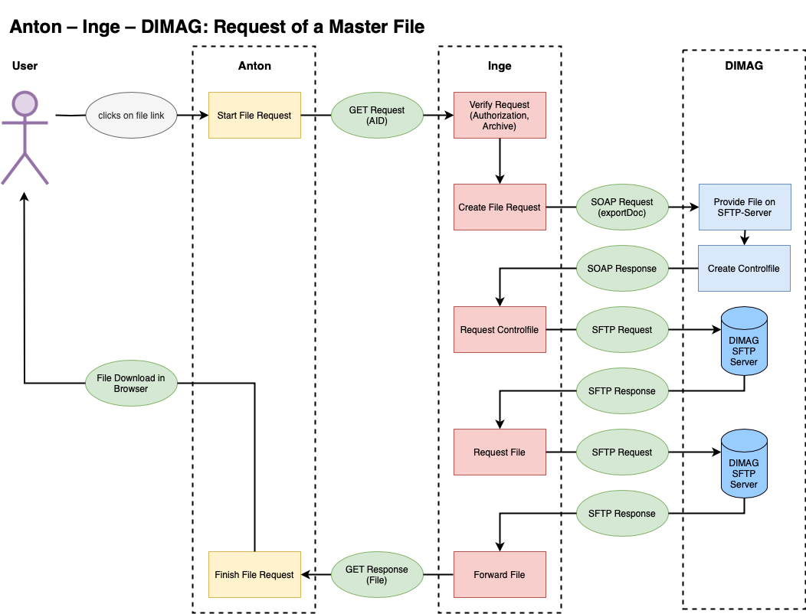

# Inge and Dimag

With Inge it is possible to integrate DIMAG as a repository for the primary data. The original files are then stored not in Anton's local file system but in DIMAG. Only the files optimised for the internet remain in Anton. Where necessary, internal users can download the original files. From the users' perspective there is therefore no difference.

## Requirements 
- Setting `fulltext-from-webpdf`: true 
- Setting `cloud`: "inge"
- .env INGE_API_TOKEN 
- User "Inge" with an email address and `api_token` for Inge

### Course of the SIP ingest

#### Anton
- User: SIP upload (zip) (`/sip/uploadsip`)
- User: SIP validation (`/sip/validation`)
    - Anton can unpack the SIP (unzip) and the metadata file is readable.
    - The files from the SIP are present and the checksums are correct.
    - Anton can find a parent in Anton for every dossier in the SIP.
- User: Anton ingest (`/sip/ingest`)
    - Backup of the database
    - Import SIP (`<dossier>` and `<dokument>`/`<datei>`)
        - SIP entry in the accession archive («draft»)
        - Import dossiers and documents/files 
            - Anton creates web versions and thumbnails
            - if the SIP ingest takes place with Inge and DIMAG, Anton deletes the master files
        - Reference codes and file names are initially based on UUIDs
    - Post import (listener `ImportFinished`)
        - Update of the archive hierarchy (`path`)
        - Update of the datings and the full-text index

The event `MediumAdded` triggers the import of the individual media, which is handled asynchronously in each case.

#### Ingest with Inge into DIMAG

The event `MediumAdded` is triggered with a delay, that is, after the import has been completed and the reference codes have already been corrected. This event triggers the conversion of the media (listener `MediumCreateWebVersion`). When Inge is used, the original file is copied into the sips path, which Inge can also access. The import into Inge then takes place (`Anton\Helpers\Inge::class`, `import`). When Inge reports success, the conversions are carried out and the master medium is deleted.

Inge: 
- Anton sends one request per file to Inge with the SIP and a list of the Anton media IDs
- Inge: ingest of the files into DIMAG
    - Inge creates a loadXML file
    - Inge creates an ingest package and stores it on DIMAG's SFTP storage
    - Inge sends a request to DIMAG: ingest of the SIP
- DIMAG: imports the package and sends the result to Inge 
- Inge: sends the result to Anton
- Anton: finalises the SIP ingest
    - Confirms the SIP ingest (the SIP entry is «final») or restores the state before the ingest from the backup 
    - Sends an email to the user Inge with the result 

### Retrieving a master file




## CLI 
```bash 
php artisan anton:import --env {slug} --from-sip --no-validation 
--create-actors -vv {path/to/sip} --import
```

### Reverting a SIP import or confirming an import with Inge

Before a SIP import, Anton backs up the database, so that if anything goes wrong the state before the import can be restored.

The backup name is stored in the SIP entry and the `Status of description` is set to draft.

The following restores the database from the last/current backup and synchronises the media with the database (namely deletes media that are not registered in the database):

```bash
php artisan anton:sip-import --env {slug} --id {sip_id} -vv --revert
```

The `sip_id` is the ID of an AntonObject that is a SIP.

The following sets the `Status of description` in the SIP entry to "final":

```bash
php artisan anton:sip-import --env {slug} --id {sip_id} -vv --confirm
```


### Checking and repairing media sync (Anton ↔ Inge ↔ Dimag)

`media:check` checks the consistency between the Anton database, the local file system, Inge and Dimag.

```bash
# overall picture (counts + verification + orphan check)
php artisan media:check --levels=1,5,6 --env={slug} -vv

# check only one particular SIP (after an interrupted ingest)
php artisan media:check --levels=1,5,6 --sip={sip_id} --env={slug} -vv

# repair cloud_status in the DB (when Inge status=20 but the DB is wrong)
php artisan media:check --levels=5 --fix-cloud-status --env={slug} -vv

# delete orphans from Inge/Dimag that are no longer in Anton
php artisan media:check --levels=6 --delete-from-inge --env={slug} -vv
```

**Levels:**

| Level | Checks | 
|-------|-------|
| 1 | Count comparison: DB, file system, Inge, Dimag. In case of a discrepancy, a diff table shows the concrete media IDs per system. |
| 2 | DB → file system (skipped with cloud=inge) |
| 3 | File system → DB. With `--delete-from-system`, orphaned directories are deleted. |
| 4 | Integrity check (checksums, skipped with cloud=inge) |
| 5 | DB → Inge: checks whether all media are present in Inge with status=20. `--fix-cloud-status` repairs the DB, `--delete-local-masters` deletes local master files after verification. |
| 6 | Inge/Dimag → DB: finds orphans in Inge or Dimag that are not in Anton. `--delete-from-inge` deletes them. Also detects media that are stuck in Inge (never reached Dimag). |

At the end, a summary table with all counts and the status of each level is output.

### Storage audit (master files and SIP directory)

`storage:audit` checks whether local master files and unpacked SIP directories have been cleaned up.

```bash
# overview: how many master files are still held locally? How many SIPs are unpacked?
php artisan storage:audit --env={slug} -vv

# delete unpacked SIP directories (ZIP archives are retained)
php artisan storage:audit --clean-sips --env={slug} -vv

# delete verified local master files (only with cloud=inge, cloud_status=1)
php artisan storage:audit --clean-masters --env={slug} -vv
```

In Inge installations, local master files should be 0. If not, `storage:audit`
points this out and `--clean-masters` cleans up verified files.

### Debugging

#### Checking the SIP import data

```bash 
php artisan sip:check --env {slug}  --path {path_to_sip} --show-sip_entry
```

```bash 
php artisan sip:check --env {slug}  --path {path_to_sip} --show-import-array
```
