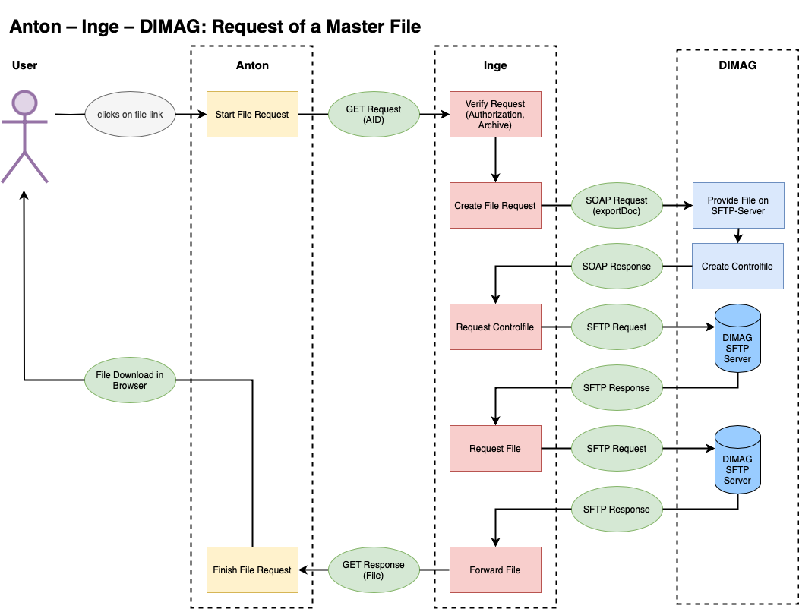

# Inge und Dimag

Mit Inge ist es möglich, DIMAG als Repository für die Primärdaten zu integrieren. Die originalen Dateien werden dann nicht im lokalen Filesystem von Anton, sondern in DIMAG gespeichert. Nur die Dateien, die für das Internet optimiert wurden, bleiben in Anton. Wenn nötig können interne User die originalen Dateien herunterladen. Aus Perspekitve der Nutzerinnen und Nutzer gibt es deshalb kein Unterschied.

<!--With Inge it is possible to integrate DIMAG as a data repository. The original files are then not stored on the Anton file system, but in DIMAG. Only files that have been optimized for use on the Internet are then stored in Anton. If required, internal users can download the original files. So there is no difference for the users.-->

## Requirements 
- Setting `fulltext-from-webpdf`: true 
- Setting `cloud`: "inge"
- .env INGE_API_TOKEN 
- User "Inge" with Email address and api_token for Inge

### Ablauf des SIP-Ingest

#### Anton
- User: SIP Upload (zip) (`/sip/uploadsip`)
- User: SIP Validation (`/sip/validation`)
    - Anton kann das SIP auspacken (unzip) und die Metadaten-Datei ist lesbar.
    - Die Dateien aus dem SIP sind vorhanden und die Prüfsummen sind korrekt.
    - Anton kann für jedes Dossier im SIP einen parent in Anton finden.
- User: Anton-Ingest (`/sip/ingest`)
    - Backup der Datenbank
    - Import SIP (`<dossier>` and `<dokument>`/`<datei>`)
        - SIP Eintrag im Akzessionsarchiv («Entwurf»)
        - Import Dossiers and Dokumente/Dateien 
            - Anton erstellt Web-Versionen und Thumbs
            - falls der SIP-Ingest mit Inge und DIMAG erfolgt löscht Anton die  Masterdateien
        - Signaturen und Dateinamen basieren zunächst auf UUIDs
    - Post Import (Listener `ImportFinished``)
        - Update der Archiv-Hierarchie (`path`)
        - Update der Datierungen und des Volltextindexes

Mit dem event `MediumAdded` wird der Import der einzelnen Medien ausgelöst, der jeweils asynchron erledigt wird.

#### Ingest mit Inge in DIMAG

Das event `MediumAdded` wird verzögert ausgelöst, d.h. nachdem der Import abgeschlossen ist und die Signaturen bereits korrigiert wurden. Dieses event löst die Konvertierung der Medien aus (Listener `MediumCreateWebVersion`). Bei Verwendung von Inge wird die Original Datei in den sips Pfad kopiert, wo auch Inge zugreifen kann. Dann erfolgt der Import in Inge (`Anton\Helpers\Inge::class`, `import`). Wenn Inge einen Erfolg zurückmeldet, werden die Konvertierungen durchgeführt und das Master Medium wir gelöscht.

Inge: 
- Anton schickt einen Request pro Datei an Inge mit dem SIP and einer Liste der Anton-Medien-Ids
- Inge: Ingest der Dateien in DIMAG
    - Inge erstellt eine loadXML-Datei
    - Inge erstellt ein Ingest-Paket und sichert es auf DIMAGs SFTP-Storage
    - Inge sendet einen Request an DIMAG: Ingest des SIP
- DIMAG: Importiert das Paket and sendet das Resultat an Inge 
- Inge: Inge sendet das Resultat an Anton
- Anton: Finalisiere den SIP-Ingest
    - Bestätige den SIP-Ingest (SIP Eintrag ist «Final») oder stelle den Zustand vor dem Ingest aus dem Backup wieder her 
    - Schicke eine Email an User Inge mit dem Resultat 

### Abfrage eines Master Files




## CLI 
```bash 
php artisan anton:import --env {slug} --from-sip --no-validation 
--create-actors -vv {path/to/sip} --import
```

### Revert a SIP Import or Confirm Import with Inge

Before a SIP Import Anton backups the database, so if anything goes wrong you can come back to the status before the Import. 

The backup name is stored in the SIP-Entry and the `Status of description` is set to draft.

This will restore the database from the last/actual backup and sync the media with the database (namely delete media wich are not registered in the database):

```bash
php artisan anton:sip-import --env {slug} --id {sip_id} -vv --revert
```

The `sip_id` is the ID of an AntonObject which is a SIP.

This will set the `Status of description` in the SIP-Entry to "final":

```bash
php artisan anton:sip-import --env {slug} --id {sip_id} -vv --confirm
```


### Checking and Repairing Media Sync (Anton ↔ Inge ↔ Dimag)

`media:check` prüft die Konsistenz zwischen Anton-Datenbank, lokalem Filesystem, Inge und Dimag.

```bash
# Gesamtüberblick (Counts + Verifikation + Orphan-Check)
php artisan media:check --levels=1,5,6 --env={slug} -vv

# Nur einen bestimmten SIP prüfen (nach unterbrochenem Ingest)
php artisan media:check --levels=1,5,6 --sip={sip_id} --env={slug} -vv

# cloud_status in der DB reparieren (wenn Inge status=20, aber DB falsch)
php artisan media:check --levels=5 --fix-cloud-status --env={slug} -vv

# Waisen aus Inge/Dimag löschen die nicht mehr in Anton sind
php artisan media:check --levels=6 --delete-from-inge --env={slug} -vv
```

**Levels:**

| Level | Prüft | 
|-------|-------|
| 1 | Count-Vergleich: DB, Filesystem, Inge, Dimag. Bei Abweichung zeigt eine Diff-Tabelle die konkreten Media-IDs pro System. |
| 2 | DB → Filesystem (übersprungen bei cloud=inge) |
| 3 | Filesystem → DB. Mit `--delete-from-system` werden verwaiste Verzeichnisse gelöscht. |
| 4 | Integritätsprüfung (Checksummen, übersprungen bei cloud=inge) |
| 5 | DB → Inge: Prüft ob alle Medien in Inge mit status=20 vorhanden sind. `--fix-cloud-status` repariert die DB, `--delete-local-masters` löscht lokale Masterdateien nach Verifikation. |
| 6 | Inge/Dimag → DB: Findet Waisen in Inge oder Dimag die nicht in Anton sind. `--delete-from-inge` löscht sie. Erkennt auch Medien die nur in Inge stecken (nie bis Dimag gelangt). |

Am Ende wird eine Summary-Tabelle mit allen Counts und dem Status jedes Levels ausgegeben.

### Storage Audit (Masterfiles und SIP-Verzeichnis)

`storage:audit` prüft ob lokale Masterdateien und entpackte SIP-Verzeichnisse bereinigt wurden.

```bash
# Überblick: Wieviele Masterfiles liegen noch lokal? Wieviele SIPs sind entpackt?
php artisan storage:audit --env={slug} -vv

# Entpackte SIP-Verzeichnisse löschen (ZIP-Archive bleiben erhalten)
php artisan storage:audit --clean-sips --env={slug} -vv

# Verifizierte lokale Masterfiles löschen (nur bei cloud=inge, cloud_status=1)
php artisan storage:audit --clean-masters --env={slug} -vv
```

Bei Inge-Installationen sollten lokale Masterfiles 0 sein. Falls nicht, weist `storage:audit` darauf hin und `--clean-masters` bereinigt verifizierte Dateien.

### Debugging

#### Check the SIP Import Data

```bash 
php artisan sip:check --env {slug}  --path {path_to_sip} --show-sip_entry
```

```bash 
php artisan sip:check --env {slug}  --path {path_to_sip} --show-import-array
```
