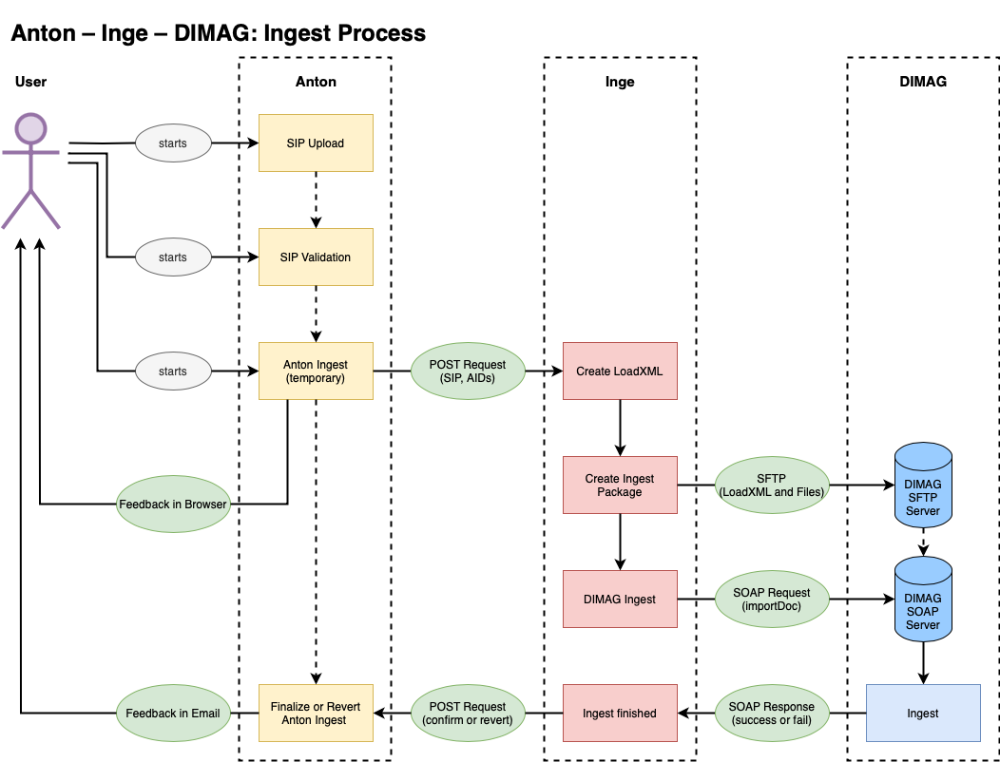
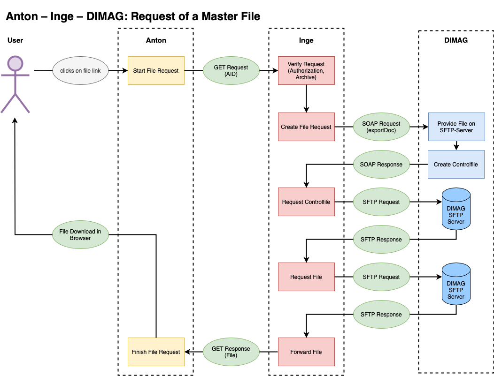

## SIP Ingest

Anton ermöglicht den Import/Ingest von Submission Information Packages (SIP) gemäss eCH-0160. Dabei werden die Dossiers und die Dokumente in die Archivtektonik importiert. 

Zum Standard: [https://ech.ch/de/ech/ech-0160/1.2.0](https://ech.ch/de/ech/ech-0160/1.2.0)

Mit Inge ist es möglich als Datenrepository DIMAG einzubinden. Dann werden die Originaldateien nicht auf dem Filesystem von Anton, sondern in DIMAG gespeichert. In Anton werden dann nur Dateien, die für die Verwendung im Internet optimiert wurden vorgehalten. Bei Bedarf können interne User die Originaldateien herunterladen. Für die User gibt es also keinen Unterschied.

### Voraussetzungen

#### Anton
- Akzessionsarchiv: Ein (gesperrtes) Archiv, dessen ID in das Setting `accessions_archives_id` eingetragen wird.
- Die Archivhierarchie (`parents`) muss bereits in Anton vorhanden sein.
- Falls die Signaturen in der Archivhierarchie ein Prefix besitzen, muss dieses gesetzt werden (setting: `identifier-prefix`)
- Mit dem Setting `strict_sip_validation` gibt Anton bei der Validierung einen Fehler aus, wenn eine Datei im SIP nicht gefunden wird.

- Anton Formular (default_intern): 
    - `sip_id`: Enthält die verlinkte Signatur auf den Eintrag des SIP im Akzessionsarchiv (sollte im Formular `default_intern`  sein)
    - `note.sip_md5sum`, `note.actual_backup` sollte im Formular `default_intern` sein (wird auf Bestandsebene/SIP angezeigt)

!!! note "Beispiel zum identifier-prefix"
    Das Elternelement (`<ordnungssystemposition>`) des `<dossier>` entspricht dem `parent` in Anton. Der `parent` in Anton wird anhand des Inhalts des Elements `<nummer>` im SIP bestimmt. Wenn also zum Beispiel diese Nummer "0.6.6" lautet, die Archivsignatur aber "A.1.4.0.6.6" ist, ist entsprechend das Prefix mit "A.1.4." auszufüllen.

#### Inge und DIMAG
- Setting `fulltext-from-webpdf`: true 
- Setting `cloud`: "inge"
- .env INGE_API_TOKEN setzen
- User "Inge" mit Email-Adresse und api_token für Inge

### Ablauf des SIP-Ingest



#### Anton
- User: SIP Upload (zip) (`/sip/uploadsip`)
- User: SIP Validation (`/sip/validation`)
    - Anton kann das SIP auspacken (unzip) und die Metadaten-Datei ist lesbar.
    - Die Dateien aus dem SIP sind vorhanden und die Prüfsummen sind korrekt.
    - Anton kann für jedes Dossier im SIP einen parent in Anton finden.
- User: Anton-Ingest (`/sip/ingest`)
    - Backup der Datenbank
    - Import SIP (`<dossier>` and `<dokument>`/`<datei>`)
        - SIP Eintrag im Akzessionsarchiv («Entwurf»)
        - Import Dossiers and Dokumente/Dateien 
            - Anton erstellt Web-Versionen und Thumbs
            - falls der SIP-Ingest mit Inge und DIMAG erfolgt löscht die  Masterdateien
        - Signaturen und Dateinamen basieren zunächst auf UUIDs
    - Post Import
        - Update der Archiv-Hierarchie (`path`)
        - Anton ersetzt UUID-Signaturen mit korrekten Signaturen und benennt die Medien entsprechend um
        - Update der Datierungen und des Volltextindexes

#### Ingest mit Inge in DIMAG
- Anton schickt einen Request an Inge mit dem SIP and einer Liste der Anton-Medien-Ids
- Inge: Ingest der Dateien in DIMAG
    - Inge erstellt eine loadXML-Datei
    - Inge erstellt ein Ingest-Paket und sichert es auf DIMAGs SFTP-Storage
    - Inge sendet einen Request an DIMAG: Ingest des SIP
- DIMAG: Importiert das Paket and sendet das Resultat an Inge 
- Inge: Inge sendet das Resultat an Anton
- Anton: Finalisiere den SIP-Ingest
    - Bestätige den SIP-Ingest (SIP Eintrag ist «Final») oder stelle den Zustand vor dem Ingest aus dem Backup wieder her 
    - Schicke eine Email an User Inge mit dem Resultat 

### Abfrage eines Master Files




## CLI 
```bash 
php artisan anton:import --env {slug} --from-sip --no-validation 
--create-actors -vv {path/to/sip} --import
```

### Revert a SIP Import or Confirm Import with Inge

Before a SIP Import Anton backups the database, so if anything goes wrong you can come back to the status before the Import. 

The backup name is stored in the SIP-Entry and the `Status of description` is set to draft.

This will restore the database from the last/actual backup and sync the media with the database (namely delete media wich are not registered in the database):

```bash
php artisan anton:sip-import --env {slug} --id {sip_id} -vv --revert
```

The `sip_id` is the ID of an AntonObject which is a SIP.

This will set the `Status of description` in the SIP-Entry to "final":

```bash
php artisan anton:sip-import --env {slug} --id {sip_id} -vv --confirm
```


### Debugging

#### Check the SIP Import Data

```bash 
php artisan sip:check --env {slug}  --path {path_to_sip} --show-sip_entry
```

```bash 
php artisan sip:check --env {slug}  --path {path_to_sip} --show-import-array
```
