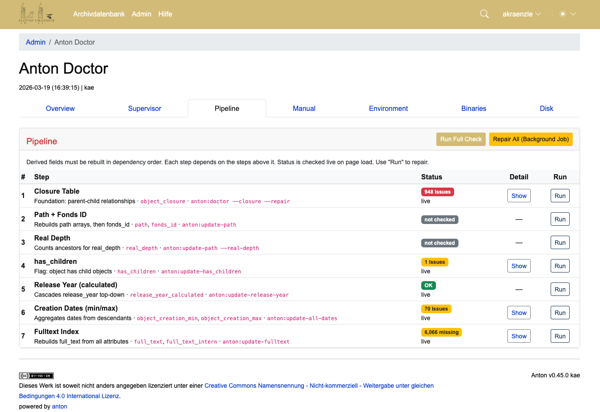

# Klosterarchiv Einsiedeln

## Pfad für Anton Backups 

`/usr/local/prj/backup/anton` 

## Probleme mit Tektonik

### Analyse
```
php artisan anton:doctor --closure --env=kae
php artisan anton:repair-closure-table --check --env=kae
```

### Reparatur
```
php artisan anton:doctor --closure --repair --env=kae
php artisan anton:repair-closure-table --force --backup --env=kae
```

Die Reparatur-Reihenfolge ist sowohl im Browser als auch CLI identisch:

- Orphaned Entries entfernen
- Missing Self-Links hinzufügen
- Missing Parent Paths reparieren
- Affected Descendants fixen
- Depth-Werte aktualisieren

## Zustand 19. März 2026


## Fehler History

Die Reparatur hat auch das Feld `objects.history` falsch upgedated: Betroffene
Datensätze wiesen in der Verzeichniskontrolle den Reparaturlauf vom
19. März 2026 (18:00–18:59) als Änderung aus, mit dem Benutzerkonto des
letzten Bearbeiters — statt der tatsächlich letzten inhaltlichen Änderung.
Vom Archiv als vermeintliche Fremdbearbeitung gemeldet.

Korrektur: Wir nehmen das `updated_at` Datum aus der history:

```sql
UPDATE objects
SET updated_at = STR_TO_DATE(
    TRIM(SUBSTRING_INDEX(TRIM(LEADING '\n' FROM history), '\n', 1)),
    '%Y-%m-%d %H:%i:%s / '
)
WHERE DATE(updated_at) = '2026-03-19'
  AND TIME(updated_at) BETWEEN '18:00:00' AND '18:59:59'
  AND history IS NOT NULL
  AND history != '';
```

Und mit leerer history (wenn wir keine history haben setzen wir updated_at = created_at)
```sql
UPDATE objects
SET updated_at = CASE
    WHEN history IS NULL OR TRIM(history) = '' OR TRIM(history) = '\n'
        THEN created_at
    ELSE
        STR_TO_DATE(
            TRIM(SUBSTRING_INDEX(TRIM(LEADING '\n' FROM history), '\n', 1)),
            '%Y-%m-%d %H:%i:%s / '
        )
END
WHERE DATE(updated_at) = '2026-03-19'
  AND TIME(updated_at) BETWEEN '18:00:00' AND '18:59:59';
```
