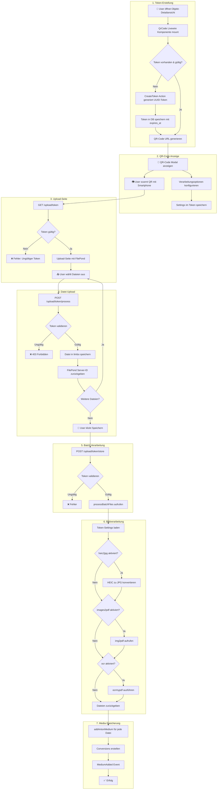

# Upload vi Mobile

```mermaid
flowchart TD
    subgraph "1. Token-Erstellung"
        A["👤 User öffnet Objekt-Detailansicht"] --> B[QrCode Livewire Komponente mount]
        B --> C{Token vorhanden & gültig?}
        C -->|Nein| D[CreateToken Action generiert UUID-Token]
        D --> E[Token in DB speichern mit expires_at]
        E --> F[QR-Code URL generieren]
        C -->|Ja| F
    end

    subgraph "2. QR-Code Anzeige"
        F --> G["📱 QR-Code Modal anzeigen"]
        G --> H[Verarbeitungsoptionen konfigurieren]
        H --> I[Settings im Token speichern]
        G --> N["📷 User scannt QR mit Smartphone"]
    end

    subgraph "3. Upload-Seite"
        N --> O[GET /upload/token]
        O --> P{Token gültig?}
        P -->|Nein| Q["❌ Fehler: Ungültiger Token"]
        P -->|Ja| R[Upload-Seite mit FilePond]
        R --> S["📤 User wählt Dateien aus"]
    end

    subgraph "4. Datei-Upload"
        S --> T[POST /upload/token/process]
        T --> U{Token validieren}
        U -->|Ungültig| V["❌ 403 Forbidden"]
        U -->|Gültig| W[Datei in limbo speichern]
        W --> X[FilePond Server-ID zurückgeben]
        X --> Y{Weitere Dateien?}
        Y -->|Ja| S
        Y -->|Nein| Z["💾 User klickt Speichern"]
    end

    subgraph "5. Batch-Verarbeitung"
        Z --> AA[POST /upload/token/store]
        AA --> AB{Token validieren}
        AB -->|Ungültig| AC["❌ Fehler"]
        AB -->|Gültig| AD[processBatchFiles aufrufen]
    end

    subgraph "6. Bildverarbeitung"
        AD --> AE[Token-Settings laden]
        AE --> AF{heic2jpg aktiviert?}
        AF -->|Ja| AG[HEIC zu JPG konvertieren]
        AF -->|Nein| AH{images2pdf aktiviert?}
        AG --> AH
        AH -->|Ja| AI[img2pdf aufrufen]
        AH -->|Nein| AJ{ocr aktiviert?}
        AI --> AJ
        AJ -->|Ja| AK[ocrmypdf ausführen]
        AJ -->|Nein| AL[Dateien zurückgeben]
        AK --> AL
    end

    subgraph "7. Media-Speicherung"
        AL --> AM[addAntonMedium für jede Datei]
        AM --> AN[Conversions erstellen]
        AN --> AO[MediumAdded Event]
        AO --> AP["✅ Erfolg"]
    end
```
