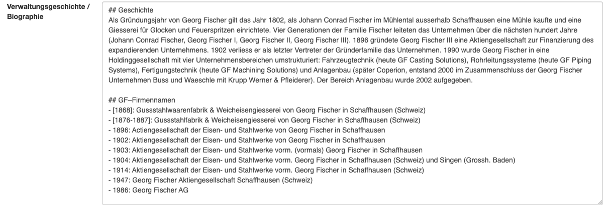
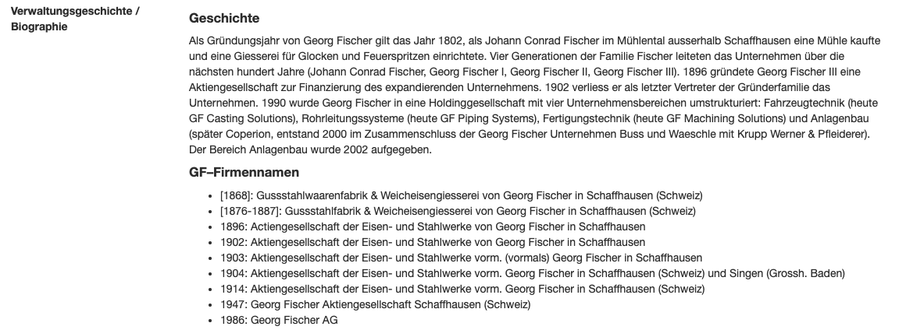

# Cataloguing

## Multi-level description according to ISAD(G)

Anton was designed as an implementation of the ISAD(G) standard and implements it in full. Hierarchical description is possible to any depth. The following designations are provided as levels of description: Collection, Recordgroup, Fonds, Series, Class, File, Item. All levels except Fonds can be repeated within themselves any number of times.

The individual areas of information defined by ISAD(G) are implemented as one or more text fields, as selection fields and/or as Anton events.

## Automatic assignment of reference codes
Anton assigns reference codes automatically on the basis of the fonds reference code, but these can be overwritten at any time. Several options are available for assigning reference codes. New reference-code generators can also be programmed and enabled for individual installations.

## Anton events
Managing actors (persons, organisations and others) separately and linking them to units of description through events also puts conceptual ideas from Records in Contexts (cf. [https://www.ica.org/en/records-in-contexts-conceptual-model](https://www.ica.org/en/records-in-contexts-conceptual-model)) into practice. Anton events contain the type of event (e.g. «creation»), a point in time or a period, optionally an actor, a place and a more detailed description.

Anton provides predefined event types, including:

- creation  
- transfer  
- provenance  
- reproduction  
- digitisation  
- receipt  
- lecture  

## Automatic calculation of date ranges
The Anton event «creation» is recorded only at the lowest level of description in each case. Anton then calculates the date range for the units of description at higher levels automatically.

## Extent (automatic calculation of extent)
In Anton, linear metres are recorded per fonds. These are then accumulated for recordgroups and for the collection. For files and items, recording the extent using the fields object type and extent (number of pieces) is recommended. A descriptive field for the extent is also available.

## Descriptors
Alongside Anton events, which describe the interaction of an actor with the unit of description, actors, places and keywords can also be used directly as descriptors for describing content. This form of description is particularly attractive for audiovisual collections.

## Text formatting and links in text fields
In its text fields, Anton understands Markdown ([https://en.wikipedia.org/wiki/Markdown](https://en.wikipedia.org/wiki/Markdown)), a simple markup language. This means that headings and lists, for example, are formatted for display in the browser. Links to external websites, to related units of description or to other pages in Anton can also be inserted easily.

Markdown text input. Headings are marked with ##; in lists, the lines simply begin with - or *.

Text in the HTML view. Headings are rendered as such. The list is formatted as well.

## Linked data and authority data
The descriptors actors, places and keywords can easily be linked to external databases and authority files. Various resources are available by default:

- Wikipedia  
- Wikidata  
- GND  
- Geonames  
- Ortsnamen  
- Metagrid  
- manual input  

When a place is linked to Geonames, the geocoordinates are stored as well and a map locating the place is displayed.

Further resources are linked automatically if a search using one of the IDs was successful.

Manual entry of resources (external links) is also possible.

## Integration of audiovisual documents and media
One or more images and other media (PDF, audio, video) can be attached to each unit of description. They are assigned by drag and drop or via Excel import. In order to catalogue images optimally (e.g. with keywords), recording each image at item level is recommended. This also allows the image gallery to be used to best effect (cf. e.g. [https://archives.georgfischer.com/gallery](https://archives.georgfischer.com/gallery) or [https://bahnarchiv.ch](https://bahnarchiv.ch)).

Most archives also use Anton as a digital long-term archive for their media. In that case it is important that the media have been validated and converted into suitable formats beforehand (pre-ingest). Anton stores and manages the archival version (e.g. TIFF) and creates access copies (e.g. JPEG) at various resolutions for external users. The archival versions are stored with a checksum, so that the integrity of the files can be verified quickly at a later point.

## Different forms for entry and display
By default, each unit of description is assigned the form set of its level of description. Typically, fields from the «context» area of information are displayed for fonds, whereas at item level the fields displayed tend to concern the physical characteristics. It is also possible to create specific form sets and assign them manually to a unit of description. The individual forms can be adapted quickly and easily.

A form set consists of 3 forms: entry (edit), internal view (internal detail) and external view (external detail). The forms define which data fields are visible in which context. The «internal detail» form typically contains the field «internal archival remarks». If that field is not included in the «external detail» form, the «internal archival remarks» are visible only to internal users, editors and admins.

## Accessions
Anton does not have a dedicated accessions module. As an alternative, newly received fonds can be created in Anton as blocked/invisible to the public (for example in an invisible sub-collection); the accession history of a fonds can be described in the field accessions/new acquisitions (ISAD(G) 3.3.3). In addition, individual transfers can be documented using the transfer form module (one entry per transfer is created with date, transferring body and comment, and displayed in the fonds record).
