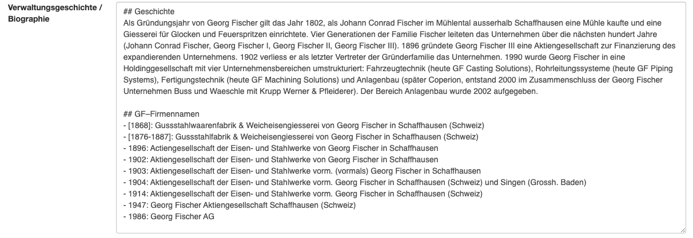
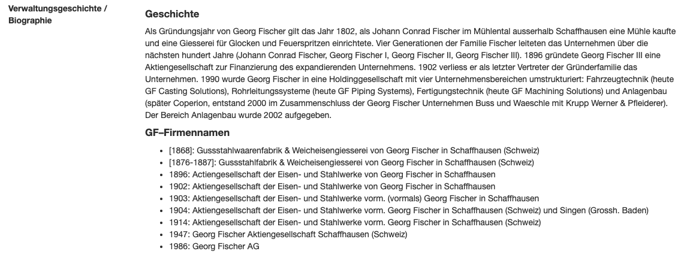

# Erschliessung

## Stufenerschliessung nach ISAD(G)

Anton wurde als Umsetzung des Standards ISAD(G) konzipiert und setzt diesen voll um. Die hierarchische Erschliessung ist beliebig tief möglich. Als Verzeichnungsstufen sind folgende Bezeichnungen vorgesehen: Archiv, Bestandsgruppe, Bestand, Serie, Klasse, Dossier, Einzelstück. Alle Verzeichnungsstufen ausser Bestand können in sich beliebig oft wiederholt werden.

Die einzelnen Informationsbereiche von ISAD(G) sind mit einem oder mehreren Textfeldern, als Auswahlfelder und/oder als Antonereignis implementiert.

## Automatische Signaturvergabe
Anton vergibt automatisch Signaturen auf der Basis der Bestandssignatur, die aber jederzeit überschrieben werden können. Es gibt verschiedene Optionen für die Signaturvergabe. Auch lassen sich neue Signatur-Generatoren programmieren und für einzelne Installationen aktivieren.

## Antonereignisse
Mit der separaten Verwaltung der Akteure (Personen, Organisationen u.a.) und deren Verknüpfung mit den Verzeichnungseinheiten in Ereignissen sind konzeptionelle Ideen von Records in Context (vgl. [https://www.ica.org/en/records-in-contexts-conceptual-model](https://www.ica.org/en/records-in-contexts-conceptual-model)) ebenfalls bereits umgesetzt. Die «Antonereignisse» enthalten den Typ des Ereignisses (z.B. «Erstellung»), einen Zeitpunkt oder Zeitraum,  optional einen Akteur, einen Ort und eine detailliertere Beschreibung.

In Anton gibt es vordefinierte Ereignistypen u.a.:

- Erstellung  
- Ablieferung  
- Provenienz  
- Reproduktion  
- Digitalisierung  
- Empfang  
- Vortrag  

## Automatische Errechnung von Laufzeiten
Das Antonereignis «Erstellung» wird nur auf der jeweils untersten Verzeichnungsebene erfasst. Anton errechnet die Laufzeit für die Verzeichnungseinheiten der höheren Stufen dann automatisch.

## Umfang (automatisch Errechnung des Umfangs)
In Anton werden pro Bestand die Laufmeter erfasst. Diese werden dann für Bestandsgruppen und das Archiv kumuliert. Für Dossiers und Einzelstücke ist die Erfassung des Umfangs mit den Feldern Objekttyp und Umfang (Stückzahl) empfohlen. Ein Beschreibungsfeld für den Umfang steht ebenfalls zur Verfügung.

## Deskriptoren
Neben den Antonereignissen, die die Interaktion eines Akteurs mit der Verzeichnungseinheit beschreiben, können die Akteure, Orte und Schlagworte auch als Deskriptoren direkt für die Inhaltsbeschreibung verwendet werden. Diese Art der Erschliessung ist besonders für audiovisuelle Sammlungen attraktiv.

## Textformatierung und Links in den Textfeldern
Anton versteht in den Textfeldern Markdown ([https://de.wikipedia.org/wiki/Markdown](https://de.wikipedia.org/wiki/Markdown)), eine einfache Auszeichnungssprache. D.h. für die Anzeige im Browser werden beispielsweise Überschriften und Listen formatiert. So können auch einfach Links auf externe Websites oder auf verwandte Verzeichnungseinheiten oder andere Seiten in Anton eingefügt werden.

Markdown Texteingabe. Überschriften werden mit gekenzeichnet ##; bei Aufzählungen beginnen die Zeilen einfach mit - oder *.

Text in der HTML-Ansicht. Überschriften werden ausgezeichnet dargestellt. Ebenso wird die Aufzählung formatiert.

## Linked Data und Normdaten
Die Deskriptoren Akteure, Orte und Schagworte können leicht mit externen Datenbanken bzw. Normdatenbanken verlinkt werden. Standardmässig sind verschiedene Ressourcen verfügbar:

- Wikipedia  
- Wikidata  
- GND  
- Geonames  
- Ortsnamen  
- Metagrid  
- manual input  

Wird ein Ort mit Geonames verlinkt, werden auch die Geokoordinaten gespeichert und eine Karte eingeblendet, die den Ort lokalisiert.

Weitere Resourcen werden automatisch verlinkt, wenn eine Suche mit einer der Ids erfolgreich war.

Auch die manuelle Eingabe von Resourcen (externen Links) ist möglich.

## Einbindung von audiovisuellen Dokument und Medien
Zu jeder Verzeichnungseinheit lassen sich ein oder mehrere Bilder und andere Medien (PDF, Ton, Video) einbinden. Die Zuordnung geschieht mittels Drag and Drop oder per Excel-Import. Um die Bilder optimal zu erschliessen (z.B. Verschlagwortung) ist die Erfassung jedes Bildes auf Einzelstückebene empfohlen. Dann lässt sich auch die Bildgalerie optimal nutzen (vgl. z.B. [https://archives.georgfischer.com/gallery](https://archives.georgfischer.com/gallery)).

Die meisten Archive nutzen Anton auch als digitales Langzeitarchiv für ihre Medien. Dann ist wichtig, dass die Medien im Vorfeld (Preingest) validiert und in geeignete Formate gebracht wurden. Anton speichert und verwaltet die Archivversion (z.\,B. TIFF) und erstellt Benutzungskopien (z.\,B. JPEG) in verschiedenen Auflösungen für externe Benutzer:innen. Die Archivversionen werden mit einer Prüfsumme gespeichert, so dass später die Integrität der Dateien schnell überprüft werden kann.

## Verschiedene Erfassungs- und Anzeigeformulare
Standardmässig ist jeder Verzeichnungseinheit der Formularsatz ihrer Verzeichnungsstufe zugeordnet. So werden typischerweise für Bestände eher Felder aus dem Informationsbereich «Kontext» angezeigt, während auf Stufe Einzelstück eher Felder angezeigt werden, die die physische Beschaffenheit betreffen. Es ist auch möglich spezifische Formularsätze zu erstellen und diese manuell einer Verzeichnungseinheit zuzuordnen. Die einzelnen Formulare sind schnell und einfach anpassbar.

Ein Formularsatz besteht aus 3 Formularen: Erfassung (Edit), Ansicht intern (Detail intern) und Ansicht extern (Detail extern). Die Formular definieren, welche Datenfelder in welchem Kontext zu sehen sind. So enthält typischerweise das Formular «Detail intern» das Feld «Archivinterne Bemerkungen». Wenn nun das Feld nicht im Formular «Detail extern» enthalten ist, sind die «Archivinternen Bemerkungen» nur für intere Benutzer:innen, Editor:innen und Anmins sichtbar.

## Akzessionen
Anton verfügt nicht über ein spezielles Akzessionsmodul. Alternativ können neu eingegangene Bestände in Anton für die Öffentlichkeit gesperrt/unsichtbar angelegt werden (etwa in einem unsichtbaren Teilarchiv); die Akzessionsgeschichte eines Bestands kann einerseits im Feld Akzessionen/Neuzugänge (ISAD(G) 3.3.3) beschrieben werden. Andererseits können die einzelnen Ablieferungen mit dem Formular-Modul Ablieferung dokumentiert werden (pro Ablieferung wird ein Eintrag mit Datum, abliefernder Stelle und Kommentar angelegt und im Bestandseintrag angezeigt).
