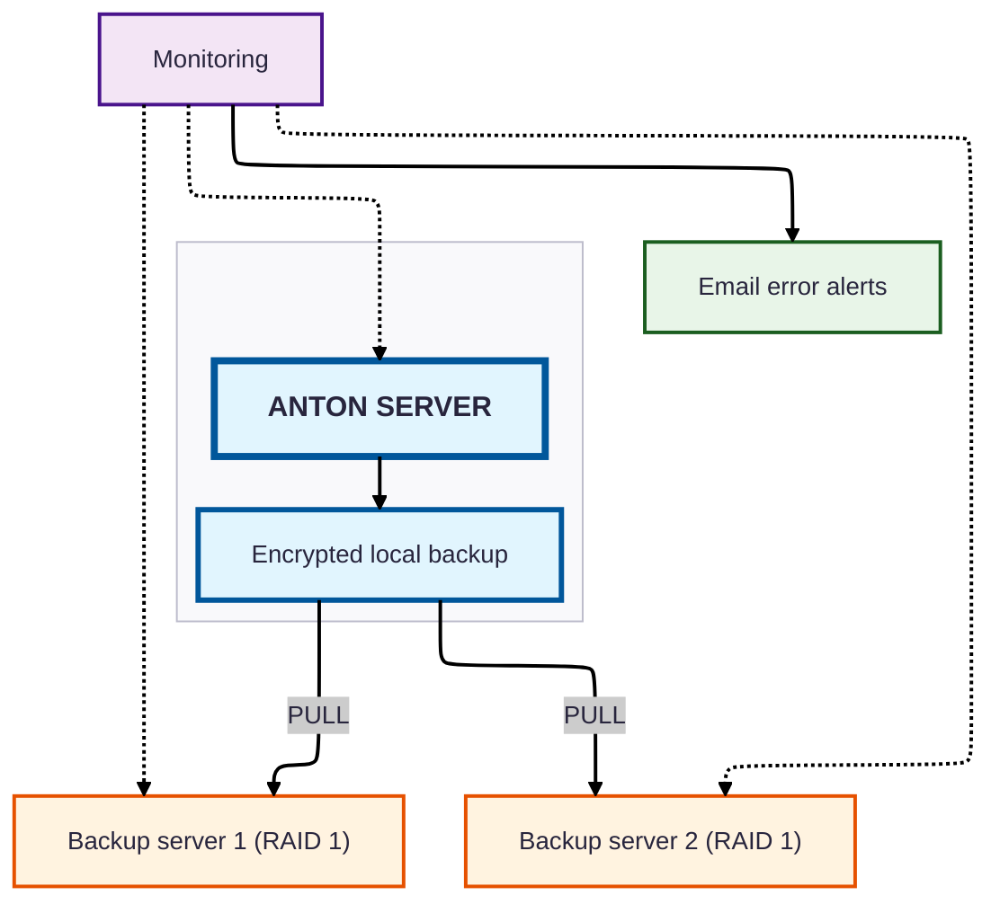

# Anton server infrastructure diagram

## Security features

- **Local data storage**: all data is stored in Switzerland
- **Multi-level backups**: 
    - Hourly metadata backups (business hours)
    - Daily full backups (metadata + digitised objects)
- **Geographical distribution**: two backup servers at two different locations in Switzerland
- **Mirroring**: both backup servers run as RAID 1, so every backup exists twice; sixfold data redundancy in total
- **Encryption**: all backups are stored and transmitted encrypted
- **Pull-based backups**: the backup servers fetch the data (no push)
    - protection against compromise of the production server
- **Continuous monitoring**: separate monitoring server
- **Proactive notification**: email alerts in case of problems
