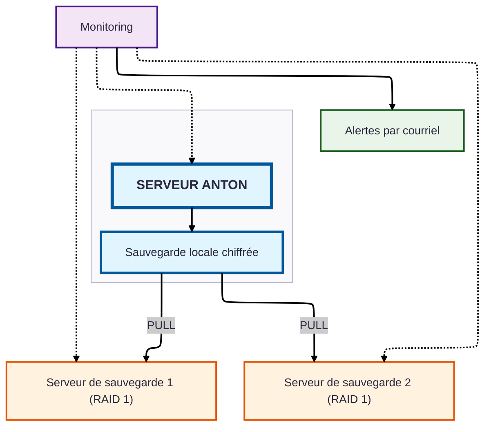

# Schéma de l'infrastructure serveur d'Anton

## Caractéristiques de sécurité

- **Stockage local des données** : toutes les données sont conservées en Suisse
- **Sauvegardes à plusieurs niveaux** : 
    - sauvegardes horaires des métadonnées (heures de bureau)
    - sauvegardes complètes quotidiennes (métadonnées + numérisations)
- **Répartition géographique** : deux serveurs de sauvegarde sur deux sites différents en Suisse
- **Mise en miroir** : les deux serveurs de sauvegarde fonctionnent en RAID 1, chaque sauvegarde existe donc en double ; au total une redondance sextuple des données
- **Chiffrement** : toutes les sauvegardes sont stockées et transmises chiffrées
- **Sauvegardes en mode pull** : les serveurs de sauvegarde vont chercher les données (pas de push)
    - protection contre une compromission du serveur de production
- **Surveillance continue** : serveur de surveillance distinct
- **Notification proactive** : alertes par courriel en cas de problème
