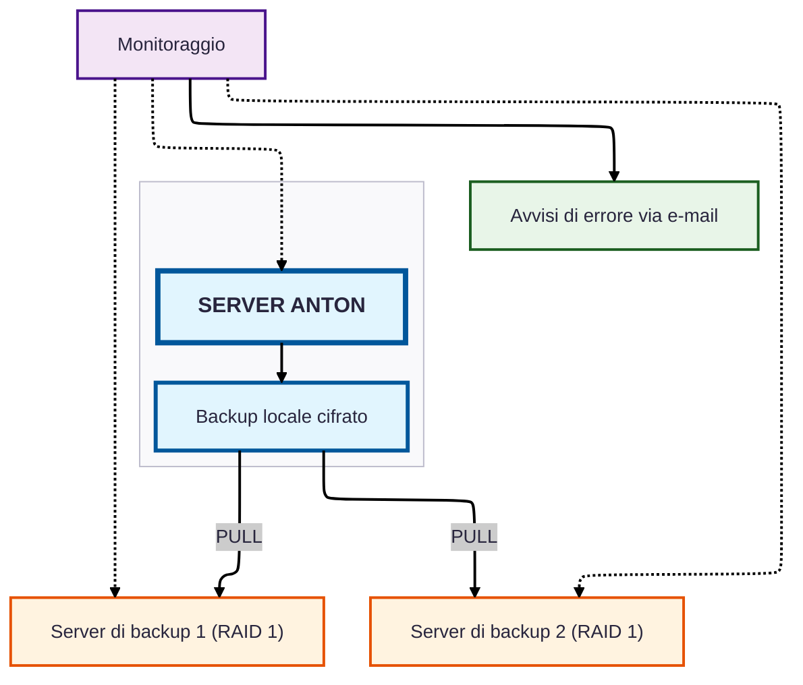

# Schema dell'infrastruttura server di Anton

## Caratteristiche di sicurezza

- **Memorizzazione locale dei dati**: tutti i dati sono conservati in Svizzera
- **Backup a più livelli**: 
    - backup orari dei metadati (orari lavorativi)
    - backup completi giornalieri (metadati + digitalizzazioni)
- **Distribuzione geografica**: due server di backup in due ubicazioni diverse in Svizzera
- **Mirroring**: entrambi i server di backup funzionano in RAID 1, ogni salvataggio è quindi presente in doppia copia; complessivamente una ridondanza sestupla dei dati
- **Cifratura**: tutti i backup vengono conservati e trasmessi in forma cifrata
- **Backup basati su pull**: sono i server di backup a prelevare i dati (nessun push)
    - protezione da una compromissione del server di produzione
- **Sorveglianza continua**: server di sorveglianza separato
- **Notifica proattiva**: avvisi via e-mail in caso di problemi
