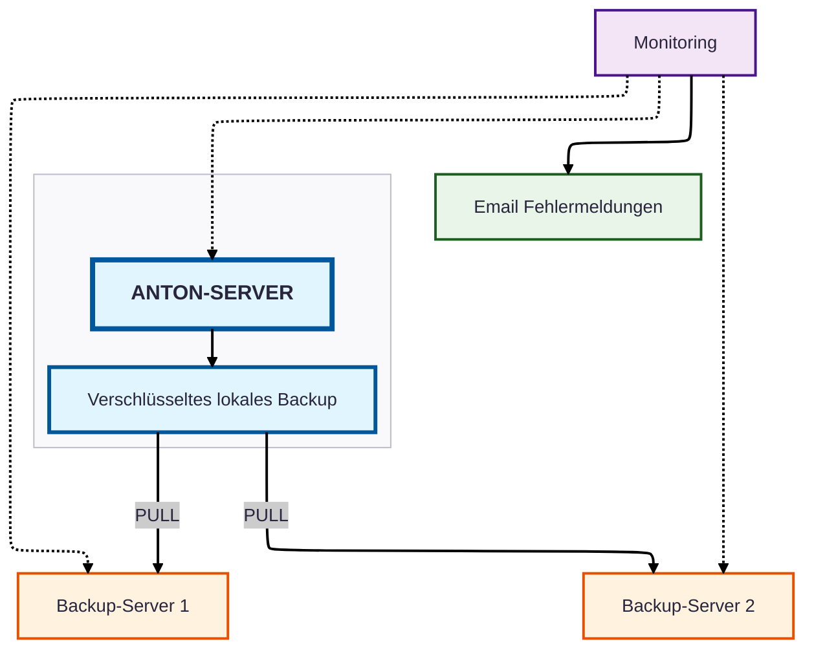

# Anton Server Infrastruktur Diagramm

## Sicherheitsmerkmale

- **Lokale Datenspeicherung**: Alle Daten werden in der Schweiz gespeichert
- **Mehrstufige Backups**: 
    - Stündliche Metadaten-Backups (Geschäftszeiten)
    - Tägliche Vollbackups (Metadaten + Digitalisate)
- **Geografische Verteilung**: Backup-Server an verschiedenen Standorten in der Schweiz
- **Verschlüsselung**: Alle Backups verschlüsselt gespeichert und übertragen
- **Pull-basierte Backups**: Backup-Server holen Daten ab (kein Push)
    - Schutz vor Kompromittierung des Produktionsservers
- **Kontinuierliche Überwachung**: Separater Überwachungsserver 
- **Proaktive Benachrichtigung**: Email-Alerts bei Problemen
