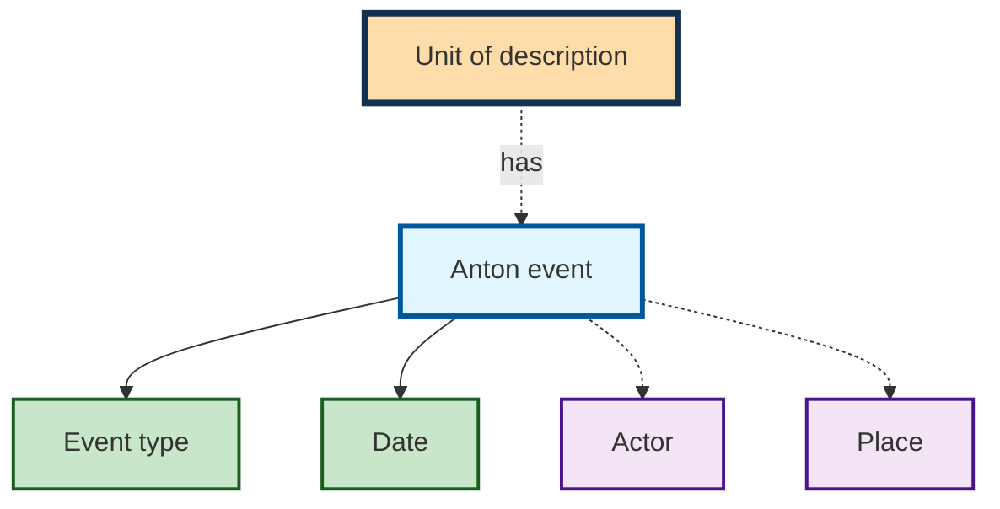

# Events

An event links [actors](actors.md) and [places](places.md) to a unit of
description — and does so **with a role and a date**. That is what distinguishes
it from keyword indexing: «engraver» or «transfer» is a statement about what
someone did, not merely that this person occurs.

An event consists of an event type, a date from and to (each with «ca.»), an
actor, a place and a comment.

## Event types

The event type **is** the role. The following are available by default:

| Type | Type |
|---|---|
| Creation Date | Provenance |
| Immediate Source of Acquisition or Transfer | Preservation |
| Existence and location of copies | Engraver |
| Digitized | Scribe |
| Reception | Colorist |
| Performance | Publisher |
| Author (Text) | Producer |
| Ingest | Other Role |

Which of these appear in the form depends on the [form set](forms.md) — a
photographic archive needs different roles from a collection of prints. Some
archives additionally maintain «loan».

!!! note "The creation date is not called that everywhere"
    The labels can be adapted per archive, and for the most important type that
    option is used: what is called **Creation Date** here appears in some
    archives as **date range** in the form. The same thing is meant — the event
    from which Anton calculates the dating and the
    [protection periods](access.md).

## Recording

Each event type forms its own row in the form. **Several events** are possible
per type — the blue **+** button on the right adds another, the red **✕**
removes one.

For the date, a from field and a to field are available with day, month and
year, each with a **ca.** checkbox for approximate information. Individual
components may be left empty. The **to=from** button adopts the start date as
the end date — practical for points in time.

Actor and place are set via selection lists with a search. The **+** beside them
creates a new actor or a new place without leaving the form.

!!! note "Date"
    A from date and a to date should always be filled in. For a point in time,
    both are identical.

All information apart from the type is optional — an event may therefore also
exist without an actor or without a date. That is rarely sensible: an event with
neither says nothing.

## The Creation Date event type

A central event type is creation. The creation date is the basis for
calculating the [protection periods](access.md). Furthermore, the creation date
is automatically **rolled up** through the archival arrangement, so that
superordinate units of description automatically show the minimum and maximum of
all creation dates of their descendants.

!!! note "TIP: using the creation date"
    Every unit of description without children should be catalogued with a
    creation date.  
    To avoid contradictions, only units of description without children should
    be catalogued with a creation date.

!!! note "Falling back to the provenance date"
    If a unit of description (a fonds or a personal papers collection, for
    example) has **no** creation date anywhere in its subtree but does carry its
    own **provenance** event with a date, that provenance date is used as the
    date range (in the detail view and in the finding aids).

    This fallback only fills gaps: as soon as a creation date exists anywhere in
    the subtree — on the object itself or on a descendant — that one takes
    precedence. The unit's own provenance date is **not** rolled up.
