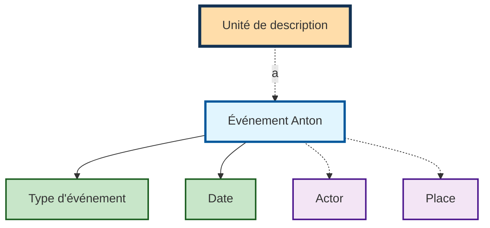

# Événements

Un événement relie des [acteur·trice·s](actors.md) et des [lieux](places.md) à
une unité de description — et ce **avec un rôle et une date**. C'est ce qui le
distingue de l'indexation par mots-clés : «&nbsp;graveur&nbsp;» ou
«&nbsp;modalités d'entrée&nbsp;» dit ce que quelqu'un a fait, et pas seulement
que cette personne apparaît.

Un événement se compose d'un type d'événement, d'une date de début et de fin
(chacune avec «&nbsp;ca.&nbsp;»), d'un·e acteur·trice, d'un lieu et d'un
commentaire.

## Types d'événement

Le type d'événement **est** le rôle. Par défaut sont disponibles :

| Type | Type |
|---|---|
| Dates de création | Provenance |
| Modalités d'entrée | Préservation |
| Existence (et lieu de conservation) de copies | Graveur |
| Numérisation | Scribe |
| Réception | Coloriste |
| Performance | Éditeur |
| Auteur (Texte) | Producteur |
| Ingest | Autre rôle |

Ceux qui apparaissent dans le masque dépendent du
[jeu de formulaires](forms.md) — un fonds photographique a besoin d'autres rôles
qu'une collection d'estampes. Certains services tiennent en outre
«&nbsp;prêt&nbsp;».

!!! note "Les dates de création ne portent pas partout ce nom"
    Les libellés sont adaptables par archive, et pour le type le plus important
    cette possibilité est utilisée : ce qui s'appelle ici
    **Dates de création** figure dans certains services sous le nom de
    **dates extrêmes**. Il s'agit de la même chose — l'événement à partir duquel
    Anton calcule la datation et les
    [délais de protection](access.md).

## Saisir

Chaque type d'événement forme une ligne propre dans le masque. **Plusieurs
événements** sont possibles par type — le bouton bleu **+** à droite en ajoute
un autre, le **✕** rouge en supprime un.

Pour la date, un champ de début et un champ de fin sont disponibles avec jour,
mois et année, chacun assorti d'une case à cocher **ca.** pour les indications
approximatives. Certains éléments peuvent rester vides. Le bouton **fin=début**
reprend la date de début comme date de fin — pratique pour les dates ponctuelles.

L'acteur·trice et le lieu se choisissent dans des listes de sélection dotées
d'une recherche. Le **+** à côté permet de créer un·e nouvel·le acteur·trice ou
un nouveau lieu sans quitter le masque.

!!! note "Date"
    Une date de début et une date de fin devraient toujours être renseignées.
    Pour une date ponctuelle, les deux sont identiques.

Toutes les indications hormis le type sont facultatives — un événement peut donc
exister sans acteur·trice ou sans date. Cela n'a que rarement du sens : un
événement dépourvu des deux ne dit rien.

## Le type d'événement Dates de création

Un type d'événement central est la création. La date de création est la base du
calcul des [délais de protection](access.md). De plus, la date de création est
automatiquement **reportée vers le haut** dans le plan de classement, de sorte
que les unités de description supérieures affichent automatiquement le minimum
et le maximum de toutes les dates de création de leurs descendants.

!!! note "CONSEIL : utilisation de la date de création"
    Toute unité de description sans unité subordonnée devrait être décrite avec
    une date de création.  
    Pour éviter les contradictions, seules les unités de description sans unité
    subordonnée devraient être décrites avec une date de création.

!!! note "Report sur la date de provenance"
    Si une unité de description (un fonds ou un legs, par exemple) ne possède
    **aucune** date de création dans l'ensemble de sa sous-arborescence mais
    porte son propre événement de **provenance** daté, cette date de provenance
    est utilisée comme dates extrêmes (dans la vue de détail et dans les
    instruments de recherche).

    Ce report ne comble que des lacunes : dès qu'une date de création existe
    quelque part dans la sous-arborescence — sur l'objet lui-même ou sur un
    descendant —, celle-ci prime. La date de provenance propre n'est **pas**
    reportée vers le haut.
