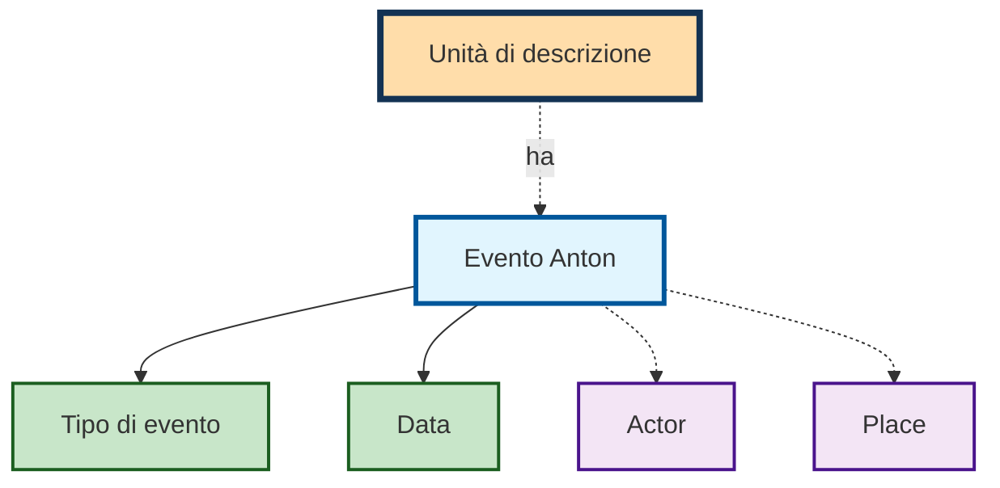

# Eventi

Un evento collega [attori e attrici](actors.md) e [luoghi](places.md) a
un'unità di descrizione — e lo fa **con un ruolo e una data**. È ciò che lo
distingue dall'indicizzazione per parole chiave: «incisore» o «modalità di
acquisizione» dice che cosa qualcuno ha fatto, non soltanto che quella persona
compare.

Un evento è composto da tipo di evento, data da e a (ciascuna con «ca.»),
attore o attrice, luogo e un commento.

## Tipi di evento

Il tipo di evento **è** il ruolo. Per impostazione predefinita sono disponibili:

| Tipo | Tipo |
|---|---|
| Periodo di creazione | Provenienza |
| Modalità di acquisizione | Conservazione |
| Copie/Riproduzioni | Incisore |
| Digitalizzato | Scrittore |
| Ricezione | Colorista |
| Performance | Editore |
| Autore (Testo) | Produttore |
| Ingest | Altro ruolo |

Quali di essi compaiano nella maschera dipende dal
[set di formulari](forms.md) — un archivio fotografico necessita di ruoli
diversi rispetto a una raccolta di stampe. Alcuni archivi gestiscono in aggiunta
«prestito».

!!! note "Il periodo di creazione non si chiama così ovunque"
    Le etichette sono adattabili per archivio, e per il tipo più importante di
    questa possibilità si fa uso: ciò che qui si chiama **Periodo di creazione**
    compare in alcuni archivi nella maschera come **estremi cronologici**. Si
    intende la stessa cosa — l'evento da cui Anton calcola la datazione e i
    [termini di protezione](access.md).

## Registrare

Ogni tipo di evento forma una riga propria nella maschera. Per ciascun tipo sono
possibili **più eventi** — il pulsante blu **+** a destra ne aggiunge un altro,
la **✕** rossa ne rimuove uno.

Per la data sono disponibili un campo da e un campo a con giorno, mese e anno,
ciascuno con una casella di controllo **ca.** per le indicazioni approssimative.
I singoli elementi possono restare vuoti. Il pulsante **a=da** riprende la data
iniziale come data finale — pratico per i momenti puntuali.

Attore o attrice e luogo si impostano tramite elenchi di selezione con ricerca.
Il **+** accanto crea un nuovo attore o attrice o un nuovo luogo senza
abbandonare la maschera.

!!! note "Data"
    Andrebbero sempre compilate sia la data iniziale sia quella finale. Per un
    momento puntuale le due coincidono.

Tutte le indicazioni tranne il tipo sono facoltative — un evento può quindi
esistere anche senza attore o attrice o senza data. Raramente ha però senso: un
evento privo di entrambi non dice nulla.

## Il tipo di evento Periodo di creazione

Un tipo di evento centrale è la creazione. La data di creazione è la base per il
calcolo dei [termini di protezione](access.md). Inoltre la data di creazione
viene **riportata automaticamente verso l'alto** nella struttura archivistica,
così che le unità di descrizione superiori mostrino automaticamente il minimo e
il massimo di tutte le date di creazione dei propri discendenti.

!!! note "SUGGERIMENTO: uso della data di creazione"
    Ogni unità di descrizione priva di unità subordinate dovrebbe essere
    descritta con una data di creazione.  
    Per evitare contraddizioni, soltanto le unità di descrizione prive di unità
    subordinate dovrebbero essere descritte con una data di creazione.

!!! note "Ripiego sulla data di provenienza"
    Se un'unità di descrizione (ad esempio un fondo o un lascito) non possiede
    **alcuna** data di creazione in tutto il proprio sottoalbero, ma reca un
    proprio evento di **provenienza** con data, questa data di provenienza viene
    utilizzata come estremi cronologici (nella vista di dettaglio e negli
    strumenti di ricerca).

    Questo ripiego colma soltanto le lacune: non appena una data di creazione è
    presente da qualche parte nel sottoalbero — sull'oggetto stesso o su un
    discendente — è quest'ultima ad avere la precedenza. La propria data di
    provenienza **non** viene riportata verso l'alto.
