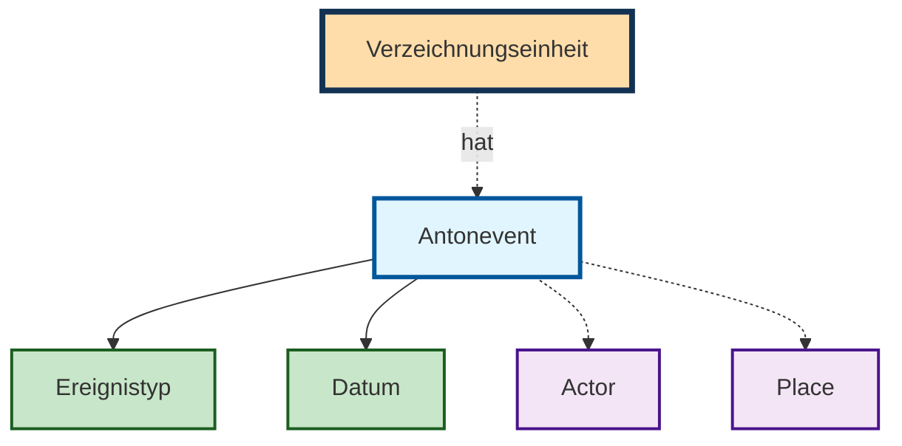

## Antonevents

Mit dem Antonevent werden die Entitäten Actor und Place mit den Verzeichnungseinheiten verknüpft. Antonevents enthalten folgende Felder:

- Ereignistyp
- Datum von  
- Datum von ca.  
- Datum bis  
- Datum bis ca.  
- Akteur*in  
- Ort  
- Beschreibung/Kommentar  

!!! note "Minimales Antonevent"
    Ein Antonvevent enthält mindestens entweder einen Actor oder ein Datum.

!!! note "Datum"
    Es sollte immmer Von- und Bis-Datum ausgefüllt werden. Für die Angabe eines Zeitpunkt sind Von- und Bis-Datum identisch.

### Ereignistyp: Creation (Laufzeit/Erstellung)

Ein zentraler Ereignistyp ist die Erstellung. Das Erstelldatum ist Grundlage für die Errechnung der [Sperrfristen](/user/access.md). Ausserdem wird das Erstelldatum automatisch in der Archivtektonik **nach oben verrechnet**, so dass übergeordnete Verzeichnungseinheiten automatisch das Minimum und Maximum aller Erstelldaten der Nachkommen anzeigen.

!!! note "TIPP: Verwendung des Erstelldatum"
    Jede Verzeichnungseinheit ohne Kinder sollte mit einem Erstelldatum erschlossen werden.  
    Um Widersprüche zu vermeiden nur Verzeichnungseinheiten ohne Kinder mit einem Erstelldatum erschlossen werden.
