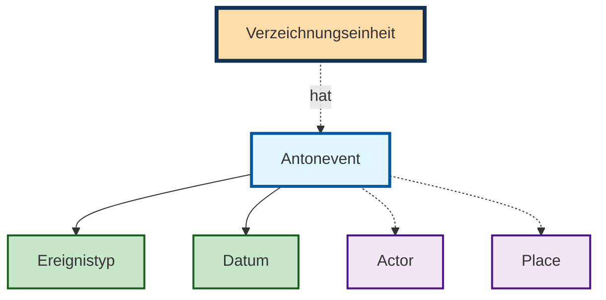

# Ereignisse

Ein Ereignis verknüpft [Akteure](actors.md) und [Orte](places.md) mit einer
Verzeichnungseinheit — und zwar **mit einer Rolle und einem Datum**. Das
unterscheidet es von der Verschlagwortung: «Stecher» oder «Ablieferung» ist
eine Aussage darüber, was jemand getan hat, nicht bloss, dass er vorkommt.

```mermaid
flowchart TD
    VE[Verzeichnungseinheit]
    AE[Antonevent]
    ET[Ereignistyp]
    DT[Datum]  
    AC[Actor]
    PL[Place]
    
    VE -.->|hat| AE
    AE --> ET
    AE --> DT
    AE -.-> AC
    AE -.-> PL
    
    %% Styling
    classDef verzeichnung fill:#ffddaa,stroke:#133253,stroke-width:4px
    classDef antonevent fill:#e1f5fe,stroke:#01579b,stroke-width:3px
    classDef core fill:#c8e6c9,stroke:#1b5e20,stroke-width:2px
    classDef entity fill:#f3e5f5,stroke:#4a148c,stroke-width:2px
    
    class VE verzeichnung
    class AE antonevent
    class ET,DT core
    class AC,PL entity
```

Ein Ereignis besteht aus Ereignistyp, Datum von und bis (je mit «ca.»),
Akteur, Ort und einem Kommentar.

## Ereignistypen

Der Ereignistyp **ist** die Rolle. Im Standard stehen zur Verfügung:

| Typ | Typ |
|---|---|
| Entstehungszeitraum | Provenienz |
| Ablieferung | Konservierung |
| Kopien/Reproduktionen | Stecher |
| Digitalisiert | Schreiber |
| Empfang | Kolorist |
| Vortrag/Aufführung | Verleger |
| Autor (Text) | Produzent |
| Ingest | Andere Rolle |

Welche davon in der Maske erscheinen, hängt vom [Formularsatz](forms.md) ab —
ein Fotoarchiv braucht andere Rollen als eine Grafiksammlung. Manche Archive
führen zusätzlich «Leihgabe».

!!! note "Der Entstehungszeitraum heisst nicht überall so"
    Die Beschriftungen sind pro Archiv anpassbar, und beim wichtigsten Typ wird
    davon Gebrauch gemacht: Was hier **Entstehungszeitraum** heisst, steht in
    manchen Archiven als **Laufzeit** in der Maske. Gemeint ist dasselbe — das
    Ereignis, aus dem Anton die Datierung und die
    [Schutzfristen](access.md) errechnet.

## Erfassen

Jeder Ereignistyp bildet in der Maske eine eigene Zeile. Pro Typ sind
**mehrere Ereignisse** möglich — die blaue Taste **+** rechts fügt ein weiteres
hinzu, das rote **✕** entfernt eines.

Für das Datum stehen je ein Von- und ein Bis-Feld mit Tag, Monat und Jahr
bereit, jeweils mit einer Checkbox **ca.** für ungefähre Angaben. Einzelne
Bestandteile dürfen leer bleiben. Die Taste **bis=von** übernimmt das Startdatum
als Enddatum — praktisch für Zeitpunkte.

Akteur und Ort werden über Auswahllisten mit Suche gesetzt. Das **+** daneben
legt einen neuen Akteur oder Ort an, ohne die Maske zu verlassen.

!!! note "Datum"
    Es sollten immer Von- und Bis-Datum ausgefüllt werden. Für einen Zeitpunkt
    sind beide identisch.

Alle Angaben ausser dem Typ sind freiwillig — ein Ereignis darf also auch ohne
Akteur oder ohne Datum bestehen. Sinnvoll ist das selten: Ein Ereignis ohne
beides sagt nichts aus.

## Ereignistyp Entstehungszeitraum

Ein zentraler Ereignistyp ist die Erstellung. Das Erstelldatum ist Grundlage für die Errechnung der [Sperrfristen](access.md). Ausserdem wird das Erstelldatum automatisch in der Archivtektonik **nach oben verrechnet**, so dass übergeordnete Verzeichnungseinheiten automatisch das Minimum und Maximum aller Erstelldaten der Nachkommen anzeigen.

!!! note "TIPP: Verwendung des Erstelldatum"
    Jede Verzeichnungseinheit ohne Kinder sollte mit einem Erstelldatum erschlossen werden.  
    Um Widersprüche zu vermeiden, sollten nur Verzeichnungseinheiten ohne Kinder mit einem Erstelldatum erschlossen werden.

!!! note "Rückfall auf das Provenienz-Datum"
    Hat eine Verzeichnungseinheit (z. B. ein Bestand oder Nachlass) in ihrem
    gesamten Teilbaum **kein** Erstelldatum, trägt aber ein eigenes
    **Provenienz**-Ereignis mit Datum, so wird dieses Provenienz-Datum als
    Laufzeit verwendet (in der Detailansicht und in den Findmitteln).

    Dieser Rückfall füllt nur Lücken: Sobald irgendwo im Teilbaum ein
    Erstelldatum vorhanden ist – am Objekt selbst oder bei einem Nachkommen –,
    hat dieses Vorrang. Das eigene Provenienz-Datum wird dabei **nicht** nach
    oben verrechnet.
