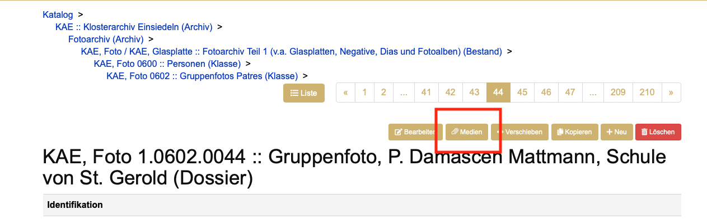
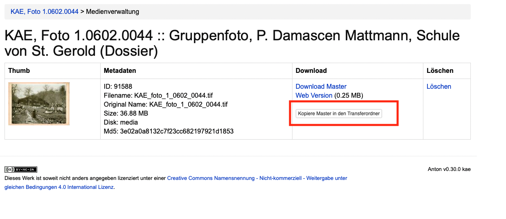
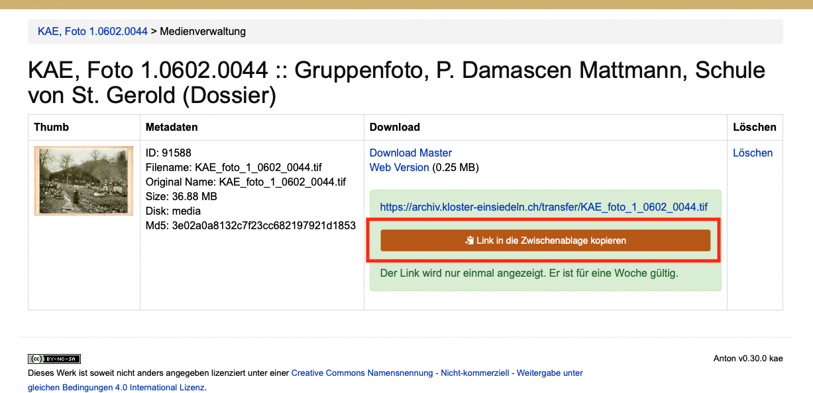

# Médias

Lors de l'import de médias, Anton crée normalement une copie de consultation. Celle-ci est optimisée pour un usage web. À moins d'être bloqués pour d'autres motifs, les utilisateur·trice·s externes n'ont accès qu'à cette version web.

## Formats de médias

De manière générale, il est recommandé d'utiliser aussi peu de formats d'entrée différents que possible. Cela rend la manipulation et la maintenance à long terme plus lisibles et plus simples. Il existe en outre des formats de fichiers mieux adaptés à l'archivage que d'autres. De nombreuses archives publiques et des services spécialisés dans l'archivage numérique à long terme donnent des informations à ce sujet.

Pour les formats suivants, Anton produit des copies de consultation ; une extension est facilement implémentable à tout moment si nécessaire. L'import d'autres formats est possible, mais devrait si possible être testé. Certains formats ne sont pas convertis (p. ex. DOCX, XLSX, TXT, ZIP).

### Photo  
- TIFF  
- JPEG2000  
- PNG  
- JPEG

### Documents  
- PDF/A
- PDF

### Vidéo
- MP4  
- Quicktime

### Audio
- WAF  
- MPEG  
- MP3  

## Métadonnées techniques (AV)

Lors du téléversement, Anton lit automatiquement les propriétés techniques via
`ffprobe` et les affiche dans l'onglet des médias de la page de détail : durée,
résolution, codec, débit, fréquence d'échantillonnage, format d'image — dans la
mesure où cela a du sens pour le fichier concerné. Pour les photographies, seule
la taille de l'image est affichée, pour l'audio pas de résolution, etc.

Les valeurs sont également livrées dans l'export RDF (profil Memobase) sous forme
de propriétés EBUcore, voir [Export RDF](../admin/download-rdf.md). Pour les
médias plus anciens déjà présents, les champs peuvent être complétés
rétroactivement par backfill — voir
[`media:extract-av-metadata`](../admin/console-commands.md#mediaextract-av-metadata).

## Modifier l'ordre des médias

L'ordre des médias d'une unité de description peut être modifié sans devoir
les supprimer et les téléverser à nouveau.

Dans l'**onglet des médias** de l'unité de description, chaque média dispose
d'une paire de flèches (↑ ↓). Un clic déplace le média d'une position à
l'intérieur de sa collection. Pour le premier et le dernier média, la flèche
correspondante est désactivée.

L'ordre s'applique à l'affichage dans le catalogue, dans la galerie et dans la
visionneuse — c'est le même ordre que celui attribué lors du téléversement.

Les images et les documents sont triés séparément : une image ne peut pas
échanger sa place avec un document.

Le réordonnancement est une modification visible et est consigné en conséquence
sur la notice (date de modification, personne ayant modifié, journal des
modifications). Il requiert la même autorisation que la suppression d'un média.

## Mettre les médias originaux à disposition
Pour mettre les médias originaux à la disposition de la clientèle, on ouvre l'onglet des médias dans une unité de description :

 
Y cliquer sur le bouton «&nbsp;Copier le master dans le dossier de transfert&nbsp;».

Copier le lien en cliquant sur «&nbsp;Copier le lien dans le presse-papiers&nbsp;».

Transmettre le lien à la personne concernée par courriel. Le lien est valable une semaine, après quoi le fichier copié est automatiquement supprimé.
