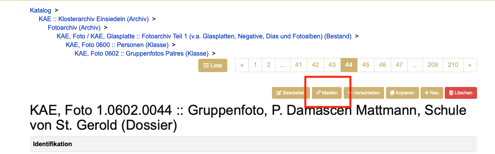
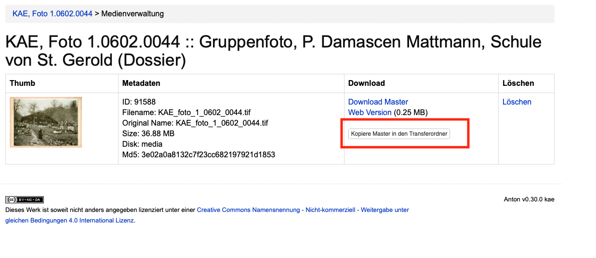
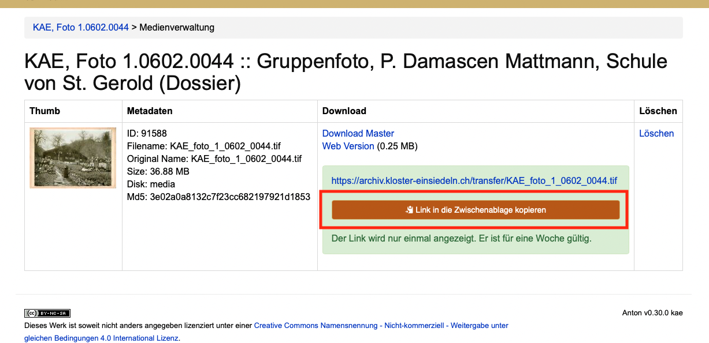

# Medien 

Bei Import von Medien erstellt Anton normalerweise eine Benutzungskopie. Diese ist für die Verwendung im Web optimiert. Wenn sie nicht aus anderen Gründen gesperrt sind, haben Externe User nur Zugriff auf diese Webversion.

## Medienformate

Grundsätzlich empfiehlt es sich, als Eingangsformate möglichst wenig verschiedene Formate zu verwenden. Das macht die Handhabung und langfristige Pflege überschaubarer und einfacher. Ausserdem gibt es Dateiformate, die für die Archivierung besser geeignet sind als andere. Darüber informieren zahlreiche staatliche Archive und auf digitale Langzeitarchivierung spezialisierte Stellen.  

Für die folgenden Formate werden in Anton Benutzungskopien angefertigt. Der Import anderer Formate ist möglich, sollte aber wenn möglich getestet werden. Manche Formate werden nicht konvertiert (z.B. DOCX, XLSX, TXT, ZIP).

### Foto  
- TIFF  
- JPEG2000  
- PNG  
- JPEG

### Dokumente
- PDF/A
- PDF

### Video
- MP4  
- Quicktime

### Audio
- WAF  
- MPEG  
- MP3  

## Originalmedien bereitstellen
Um für Kundinnen die originalen Medien bereitzustellen, kann man in einer Verzeichnungseinheit auf den Medien-Reiter aufrufen:

 
Dort die Taste «Kopiere Master in den Transferordner» anklicken.

Mit Klick auf «Link in die Zwischenablage kopieren» den Link kopieren.

Den Link der/m Kunden/Kundin per Email zukommen lassen. Der Link ist eine Woche gültig, danach wird die kopierte Datei automatisch gelöscht.
