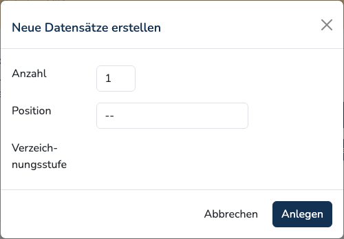
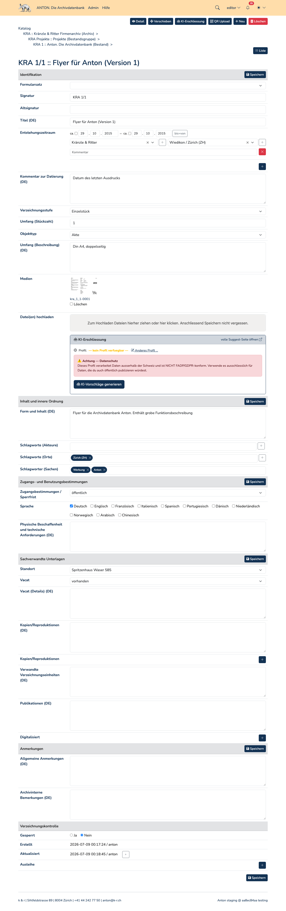

# Unità di descrizione

L'unità di descrizione è la scheda centrale in Anton. Occupa sempre una precisa
posizione nella [struttura archivistica](hierarchy.md) — come archivio, fondo,
serie, unità archivistica o unità documentaria.

## Creare nuove schede

Anton non prevede un formulario vuoto «nuova scheda». Il punto di partenza è
sempre una scheda esistente: è da lì che si stabilisce dove agganciare le nuove
unità.

1. Nella vista di dettaglio o di modifica fare clic sul pulsante **Nuovo**. Si
   apre la finestra «Creare nuove schede».
2. Indicare il **numero** — più unità dello stesso livello possono essere create
   in un solo passaggio.
3. Scegliere la **posizione**: **prima**, **dentro** o **dopo** la scheda
   corrente. Con «dentro» la scheda corrente diventa l'unità superiore; con
   «prima» e «dopo» nasce un'unità dello stesso livello.
4. Scegliere il **livello di descrizione**. Il campo di selezione compare solo
   dopo aver scelto una posizione e contiene unicamente i livelli ammessi in
   quel punto — sotto un'unità archivistica, quindi, solo unità archivistica e
   unità documentaria.

Con **Crea**, Anton attribuisce automaticamente la [segnatura](identifiers.md)
e apre direttamente la maschera di modifica della prima scheda creata.

!!! note "Creare archivi"
    Un archivio al livello più alto non può essere creato per questa via, che
    presuppone una scheda esistente. La configurazione iniziale è compito
    dell'amministrazione.

## Modificare

La maschera di modifica è un elenco continuo, suddiviso da sezioni su sfondo
grigio:

Quali sezioni e campi compaiano dipende dal [set di formulari](forms.md) ed è
configurabile per archivio. Nel formulario standard sono: identificazione,
contesto, contenuto e struttura, condizioni di accesso e uso, documentazione
collegata, note e controllo della descrizione. Non tutti i livelli di
descrizione mostrano tutte le sezioni — nell'unità documentaria manca
«contesto».

Ogni sezione dispone a destra di un proprio pulsante **Salva**; ve n'è uno
ulteriore alla fine del formulario. Viene salvato sempre l'intero formulario e
non soltanto la sezione. Dopo il salvataggio Anton passa alla vista di
dettaglio.

!!! warning "Le segnature non sono univoche"
    Anton non impone segnature univoche. Se viene inserita una segnatura già
    attribuita, al salvataggio compare un avviso con il rimando alle schede
    interessate — il salvataggio avviene comunque. L'avviso non è
    deliberatamente bloccante, poiché nella pratica i doppioni esistono.

## Copiare

Nella vista di dettaglio — non nella maschera di modifica — si trova il pulsante
**Copia**. Nella finestra «Copiare la scheda» si indica il numero di copie.
Vengono copiati titolo, campi di testo, eventi, attori e attrici, luoghi e
parole chiave; la copia viene agganciata come unità dello stesso livello subito
dopo l'originale e riceve una nuova segnatura. I media non vengono copiati.

## Eliminare

Il pulsante **Elimina** apre la finestra «Eliminare la scheda» con la richiesta
«Eliminare davvero questa scheda?». Per confermare occorre inserire la
**propria password**.

!!! danger "L'eliminazione è definitiva"
    Anton non dispone di un cestino. Vengono eliminati la scheda, tutte le unità
    di descrizione subordinate e i loro media, file compresi. Un ripristino è
    possibile solo a partire da un [backup](../admin/restore.md).
