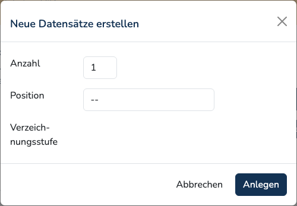
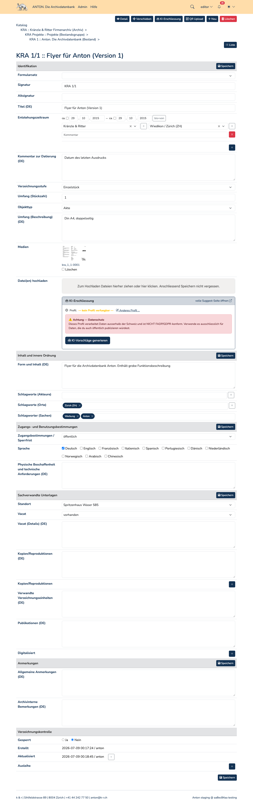

# Verzeichnungseinheiten

Die Verzeichnungseinheit ist der zentrale Datensatz in Anton. Sie steht immer an
einer Stelle der [Tektonik](hierarchy.md) — als Archiv, Bestand, Serie, Dossier
oder Einzelstück.

## Neue Datensätze anlegen

Anton kennt kein leeres Formular «Neuer Datensatz». Ausgangspunkt ist immer ein
bestehender Datensatz: Von dort aus wird festgelegt, wo die neuen Einheiten
eingehängt werden.

1. Auf der Detail- oder Bearbeitungsansicht die Taste **Neu** anklicken. Es
   öffnet sich das Fenster «Neue Datensätze erstellen».
2. **Anzahl** angeben — mehrere Geschwister lassen sich in einem Schritt anlegen.
3. **Position** wählen: **vor**, **in** oder **nach** dem aktuellen Datensatz.
   Bei «in» wird der aktuelle Datensatz zum übergeordneten, bei «vor» und «nach»
   entsteht ein Geschwister.
4. **Verzeichnungsstufe** wählen. Das Auswahlfeld erscheint erst, nachdem eine
   Position gewählt wurde, und enthält nur die an dieser Stelle zulässigen
   Stufen — unter einem Dossier also nur Dossier und Einzelstück.

Mit **Anlegen** vergibt Anton die [Signatur](identifiers.md) automatisch und
öffnet direkt die Bearbeitungsmaske des ersten neuen Datensatzes.

!!! note "Archive anlegen"
    Ein Archiv auf oberster Ebene lässt sich über diesen Weg nicht erstellen, da
    er einen bestehenden Datensatz voraussetzt. Die Ersteinrichtung erfolgt durch
    die Administration.

## Bearbeiten

Die Bearbeitungsmaske ist eine durchgehende Liste, gegliedert durch grau
hinterlegte Abschnitte:

Welche Abschnitte und Felder erscheinen, hängt vom
[Formularsatz](forms.md) ab und ist pro Archiv konfigurierbar. Im
Standardformular sind es: Identifikation, Kontext, Inhalt und innere Ordnung,
Zugangs- und Benutzungsbestimmungen, Sachverwandte Unterlagen, Anmerkungen und
Verzeichnungskontrolle. Nicht jede Verzeichnungsstufe zeigt alle Abschnitte — beim
Einzelstück fehlt «Kontext».

Jeder Abschnitt hat rechts eine eigene Taste **Speichern**; zusätzlich steht eine
am Ende des Formulars. Gespeichert wird jeweils das ganze Formular, nicht nur der
Abschnitt. Nach dem Speichern wechselt Anton in die Detailansicht.

!!! warning "Doppelte Signaturen"
    Vergibt eine bereits vergebene Signatur, meldet Anton dies mit Verweis auf die
    betroffenen Datensätze. Die Meldung ist ein Hinweis und verhindert das
    Speichern nicht — Signaturen dürfen mehrfach vorkommen.

## Kopieren

Auf der Detailansicht — nicht in der Bearbeitungsmaske — steht die Taste
**Kopieren**. Im Fenster «Datensatz kopieren» wird die Anzahl Kopien angegeben.
Kopiert werden Titel, Textfelder, Ereignisse, Akteure, Orte und Schlagwörter;
die Kopie wird als Geschwister direkt hinter dem Original eingehängt und erhält
eine neue Signatur. Medien werden nicht mitkopiert.

## Löschen

Die Taste **Löschen** öffnet das Fenster «Datensatz löschen» mit der Rückfrage
«Diesen Datensatz wirklich löschen?». Zur Bestätigung ist das **eigene Passwort**
einzugeben.

!!! danger "Löschen ist endgültig"
    Anton führt keinen Papierkorb. Gelöscht werden der Datensatz, alle
    untergeordneten Verzeichnungseinheiten und deren Medien samt Dateien. Ein
    Wiederherstellen ist nur über eine [Sicherung](../admin/restore.md) möglich.
