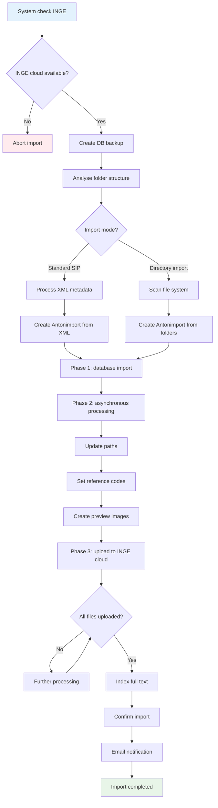

# SIP import in Anton

## Overview

The SIP import makes it possible to import archival packages (SIPs – Submission Information Packages) into Anton automatically. All documents, metadata and the folder structure are adopted and stored securely in the INGE cloud.

The import process is divided into three main phases, corresponding to the tabs in the Anton interface:

1. **Upload** – upload the SIP file
2. **Validation** – check and validate the file  
3. **Ingest** – carry out the import and process the documents

!!! note "A shared import hub"
    All import paths (SIP, Excel, directory, agate) are brought together under `/import` — the SIP tabs are now integrated into the import hub as the **«SIP»** tab. Old bookmarks continue to work (transparent redirect).
    See [import.md](import.md).

## Upload

- The maximum file size depends on the system configuration. Please report any problems to the administration.

## Validation

### Automatic file check

#### What the system checks

- Completeness of the ZIP file  
- Presence of the metadata.xml according to the eCH-0160 standard  
- Integrity of all document files (MD5 checksums)  
- Correct folder structure and hierarchy (in particular whether the root files of the SIP can be attached to the existing archival structure)  
- Uniqueness (SIPs already imported are recognised)

#### What you see

- A detailed validation report  
- Green ticks for successful checks  
- Red error messages with concrete pointers  
- Status «validation passed» or «validation failed»

#### Possible problems

- The parent for the root files cannot be found
- Damaged or incomplete ZIP file  
- Missing or invalid metadata.xml  
- Defective document files  
- SIP file already imported

## Ingest

### SIP import workflow

!!! Bug "If the import fails" 
    - Open the SIP record in the accession archive  
    - Restore the database from the backup (files are synchronised with Inge/Dimag)  

### Import modes

#### Standard SIP import

The `import-dossier-from-directory` setting has to be empty or set to 0 or false.

#### How it works
- The folder structure is created from the XML metadata (file/document structure)
- Every file, every folder and every document is defined in the metadata.xml
- The hierarchy is based on the XML structure of the `<ablieferung>` (parent-child relationships)

#### Advantages
- Complete metadata from the transferring system
- Exact adoption of the logical structure of the SIP
- Information on the context of creation and provenance from the XML

#### Directory import

Two structures are presented in the `metadata.xml`:  

1) The storage structure of the files in the file system (folders/files) in the `content` folder corresponds to the `<inhaltsverzeichnis>` in the `metadata.xml`  
2) The `ablieferung` element contains the position in the overall hierarchy (elements `<ordnungssystem>`, `<ordnungssystemposition>`) as well as the logical structure of the actual content of the transfer in files (`dossier>`) and documents (`<dokument>`) (whereby the documents may contain a reference to files).

The two structures may correspond to one another, but need not. In practice there are files whose storage structure deviates considerably from the logical structure. It can therefore make sense to adopt the storage structure rather than the SIP structure actually provided for.

The `import-dossier-from-directory` setting has to be set to 1 or true.

!!! note "Important"
    The directory import only works with one file (dossier) per SIP.

#### How it works

The hierarchy is created from the file system of the SIP file (folder: `content`, corresponding to the folder-file structure in the metadata.xml; the logical structure of the files and documents is ignored. The metadata cannot be imported either.)

- The root folder in the content folder is equated with the file (dossier) of the SIP.
- File metadata is generated from the file properties (as far as possible).
- XML metadata is used only for the root file (dossier).

## Duration
Example: importing 100 records with 100 files takes around 10 minutes.

During phase 1 the page does not respond and the browser must not be closed. In the example, this phase takes around 2 minutes.

Phase 2 runs asynchronously, but is still not visible in the browser (another 2 minutes).

After that, it is possible to follow how the system works through phase 3.

*Last updated: 2025-08-05*
