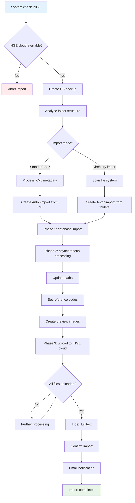

# SIP import in Anton

## Overview

The SIP import takes archival packages following eCH-0160 (SIPs, Submission Information Packages) into Anton: documents, metadata and folder structure. It has four tabs:

1. **Upload** – store SIP files
2. **Check and import** – check or import each uploaded SIP, with all events below
3. **Imported SIPs** – the SIPs that have already been imported
4. **Documentation**

!!! note "A shared import hub"
    All import paths (SIP, Excel, directory, agate) are brought together under `/import`. See [import.md](import.md).

## Upload

- SIPs can be uploaded as ZIP, TAR or TAR.GZ, several at once. The maximum file size depends on the system configuration; please report problems to the administration.
- If a file with the same name is already there, or the same content is already present or already imported, Anton does not store the file at once but asks first:

| Finding | Choice |
|---|---|
| same name, same content («already present, unchanged») | Discard |
| same name, other content («replaces …») | Replace or Discard |
| same content under another name | Store anyway or Discard |
| same content already imported (with date and identifier) | Store anyway or Discard |

Files without a finding are stored at once.

## Check and import

The table shows every uploaded SIP, the newest at the top, with size, date and its last check. The check belongs to the content of the file, not to its name: if another SIP is uploaded under the same name, the column shows «–» again.

- **Check** shows all findings without importing anything.
- **Import** starts the import. The import checks the SIP itself anyway; a check beforehand is not required.
- A SIP that is being checked or imported can only be deleted afterwards.

### The check

The check page shows every step of the check with its state; the running step has a progress bar:

1. Unpack the SIP
2. Check the structure of the SIP (also: already imported?)
3. Check the metadata against the schema
4. Check the public access status
5. Check files and checksums
6. Check where the dossiers attach (can the root dossiers be attached to the existing archival structure?)
7. Check the hierarchy
8. Check the data

An error in steps 1 to 3 ends the check; the following steps then show «not reached». At the end, the findings are listed by kind with an explanation and advice. If the SIP is valid, it can be imported from there.

A check that runs longer than its time limit counts as «broken off» and has to be started again.

### Events

Below the table are all events of the SIPs: upload (also replaced or discarded), check, import, move after the import and deletion – with time, file, result and user. A check leads to its check page, an import to its run.

## Imported SIPs

After a successful import, Anton files the SIP here, with the identifier of the import before the file name. It can still be downloaded; only admins can delete it.

## Ingest

### SIP import workflow

```mermaid
flowchart TD
    A[System check INGE] --> B{INGE cloud available?}
    B -->|No| C[Abort import]
    B -->|Yes| D[Create DB backup]
    
    D --> E[Analyse folder structure]
    E --> F{Import mode?}
    
    F -->|Standard SIP| G[Process XML metadata]
    F -->|Directory import| H[Scan file system]
    
    G --> I[Create Antonimport from XML]
    H --> J[Create Antonimport from folders]
    
    I --> K[Phase 1: database import]
    J --> K
    
    K --> L[Phase 2: asynchronous processing ]
    L --> M[Update paths]
    M --> N[Set reference codes]
    N --> O[Create preview images]
    O --> P[Phase 3: upload to INGE cloud]
    
    P --> Q{All files uploaded?}
    Q -->|No| R[Further processing]
    Q -->|Yes| S[Index full text]
    
    R --> Q
    S --> T[Confirm import]
    T --> U[Email notification]
    U --> V[Import completed]
    
    style A fill:#e3f2fd
    style V fill:#e8f5e8
    style C fill:#ffebee
```

!!! Bug "If the import fails" 
    - Open the SIP record in the accession archive  
    - Restore the database from the backup (files are synchronised with Inge/Dimag)  

### Import modes

#### Standard SIP import

The `import-dossier-from-directory` setting has to be empty or set to 0 or false.

#### How it works
- The folder structure is created from the XML metadata (file/document structure)
- Every file, every folder and every document is defined in the metadata.xml
- The hierarchy is based on the XML structure of the `<ablieferung>` (parent-child relationships)

#### Advantages
- Complete metadata from the transferring system
- Exact adoption of the logical structure of the SIP
- Information on the context of creation and provenance from the XML

#### Directory import

Two structures are presented in the `metadata.xml`:  

1) The storage structure of the files in the file system (folders/files) in the `content` folder corresponds to the `<inhaltsverzeichnis>` in the `metadata.xml`  
2) The `ablieferung` element contains the position in the overall hierarchy (elements `<ordnungssystem>`, `<ordnungssystemposition>`) as well as the logical structure of the actual content of the transfer in files (`dossier>`) and documents (`<dokument>`) (whereby the documents may contain a reference to files).

The two structures may correspond to one another, but need not. In practice there are files whose storage structure deviates considerably from the logical structure. It can therefore make sense to adopt the storage structure rather than the SIP structure actually provided for.

The `import-dossier-from-directory` setting has to be set to 1 or true.

!!! note "Important"
    The directory import only works with one file (dossier) per SIP.

#### How it works

The hierarchy is created from the file system of the SIP file (folder: `content`, corresponding to the folder-file structure in the metadata.xml; the logical structure of the files and documents is ignored. The metadata cannot be imported either.)

- The root folder in the content folder is equated with the file (dossier) of the SIP.
- File metadata is generated from the file properties (as far as possible).
- XML metadata is used only for the root file (dossier).

## Duration
Example: importing 100 records with 100 files takes around 10 minutes.

During phase 1 the page does not respond and the browser must not be closed. In the example, this phase takes around 2 minutes.

Phase 2 runs asynchronously, but is still not visible in the browser (another 2 minutes).

After that, it is possible to follow how the system works through phase 3.

*Last updated: 2026-10-01*
