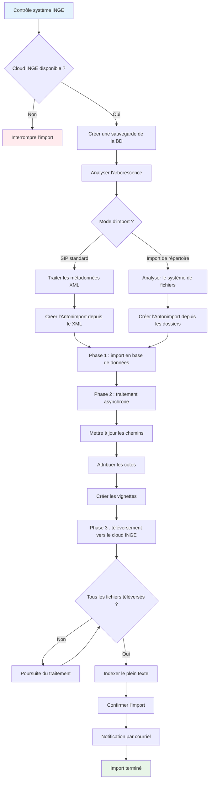

# Import SIP dans Anton

## Vue d'ensemble

L'import SIP permet d'importer automatiquement dans Anton des paquets d'archives (SIP – Submission Information Packages). Tous les documents, les métadonnées et l'arborescence des dossiers sont repris et enregistrés de manière sûre dans le cloud INGE.

Le processus d'import se divise en trois phases principales, correspondant aux onglets de l'interface d'Anton :

1. **Téléversement** – téléverser le fichier SIP
2. **Validation** – contrôler et valider le fichier  
3. **Ingest** – effectuer l'import et traiter les documents

!!! note "Depuis la v0.62.0 : un hub d'import commun"
    Toutes les voies d'import (SIP, Excel, répertoire, agate) sont regroupées sous `/import` — les onglets SIP sont désormais intégrés au hub d'import sous l'onglet **«&nbsp;SIP&nbsp;»**. Les anciens signets continuent de fonctionner (redirection transparente).
    Voir [import.md](import.md).

## Téléversement

- La taille maximale des fichiers dépend de la configuration du système. Merci de signaler tout problème à l'administration.

## Validation

### Contrôle automatique du fichier

#### Ce que le système contrôle

- L'intégralité du fichier ZIP  
- La présence du metadata.xml conforme à la norme eCH-0160  
- L'intégrité de tous les fichiers de documents (sommes de contrôle MD5)  
- L'exactitude de l'arborescence et de la hiérarchie (en particulier la possibilité de rattacher les dossiers racine du SIP à la structure archivistique existante)  
- L'unicité (les SIP déjà importés sont détectés)

#### Ce que vous voyez

- Un rapport de validation détaillé  
- Des coches vertes pour les contrôles réussis  
- Des messages d'erreur rouges assortis d'indications concrètes  
- Le statut «&nbsp;validation réussie&nbsp;» ou «&nbsp;validation échouée&nbsp;»

#### Problèmes possibles

- Le parent des dossiers racine est introuvable
- Fichier ZIP endommagé ou incomplet  
- metadata.xml manquant ou non valide  
- Fichiers de documents défectueux  
- Fichier SIP déjà importé

## Ingest

### Déroulement de l'import SIP

!!! Bug "Si l'import échoue" 
    - Ouvrir la notice SIP dans les archives d'accroissement  
    - Restaurer la base de données depuis la sauvegarde (les fichiers sont synchronisés avec Inge/Dimag)  

### Modes d'import

#### Import SIP standard

Le paramètre `import-dossier-from-directory` doit être vide ou défini sur 0 ou false.

#### Fonctionnement
- L'arborescence est créée à partir des métadonnées XML (structure dossiers/documents)
- Chaque dossier, chaque sous-dossier et chaque document est défini dans le metadata.xml
- La hiérarchie repose sur la structure XML de l'`<ablieferung>` (relations parent-enfant)

#### Avantages
- Métadonnées complètes issues du système versant
- Reprise exacte de la structure logique du SIP
- Informations sur le contexte de création et la provenance issues du XML

#### Import de répertoire

Deux structures sont présentées dans le `metadata.xml` :  

1) La structure de rangement des fichiers dans le système de fichiers (dossiers/fichiers) du répertoire `content` correspond à l'`<inhaltsverzeichnis>` du `metadata.xml`  
2) L'élément `ablieferung` contient la position dans la hiérarchie d'ensemble (éléments `<ordnungssystem>`, `<ordnungssystemposition>`) ainsi que la structure logique du contenu proprement dit du versement, en dossiers (`dossier>`) et documents (`<dokument>`) (les documents pouvant contenir un renvoi à des fichiers).

Les deux structures peuvent se correspondre, mais ce n'est pas obligatoire. Dans la pratique, il existe des dossiers dont la structure de rangement s'écarte considérablement de la structure logique. Il peut donc être judicieux de reprendre la structure de rangement plutôt que la structure SIP initialement prévue.

Le paramètre `import-dossier-from-directory` doit être défini sur 1 ou true.

!!! note "Important"
    L'import de répertoire ne fonctionne qu'avec un seul dossier par SIP.

#### Fonctionnement

La hiérarchie est créée à partir du système de fichiers du SIP (répertoire `content`, ce qui correspond à la structure dossiers-fichiers du metadata.xml ; la structure logique des dossiers et documents est ignorée. Les métadonnées ne peuvent pas non plus être importées.)

- Le dossier racine du répertoire content est assimilé au dossier du SIP.
- Les métadonnées des fichiers sont générées à partir de leurs propriétés (dans la mesure du possible).
- Les métadonnées XML ne sont utilisées que pour le dossier racine.

## Durée
Exemple : l'import de 100 notices comportant 100 fichiers dure environ 10 minutes.

Pendant la phase 1, la page ne répond pas et le navigateur ne doit pas être fermé. Dans l'exemple, cette phase dure environ 2 minutes.

La phase 2 s'exécute de manière asynchrone, mais reste encore invisible dans le navigateur (2 minutes de plus).

Ensuite, il est possible de suivre le traitement de la phase 3 par le système.

*Dernière mise à jour : 2025-08-05*
