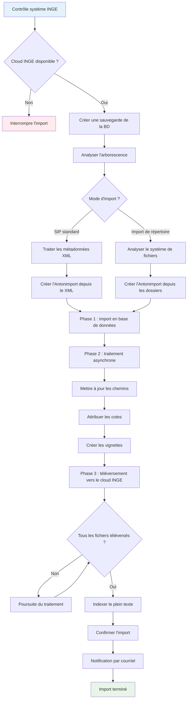

# Import SIP dans Anton

## Vue d'ensemble

L’importation SIP reprend dans Anton des paquets d’archives selon eCH-0160 (SIP, Submission Information Packages) : documents, métadonnées et structure de dossiers. Elle comporte quatre onglets :

1. **Téléverser** – déposer des fichiers SIP
2. **Vérifier et importer** – vérifier ou importer chaque SIP téléversé, avec tous les événements en dessous
3. **SIP importés** – les SIP déjà importés
4. **Documentation**

!!! note "Un hub d’importation commun"
    Tous les chemins d’importation (SIP, Excel, répertoire, agate) sont réunis sous `/import`. Voir [import.md](import.md).

## Téléversement

- Les SIP peuvent être téléversés au format ZIP, TAR ou TAR.GZ, plusieurs à la fois. La taille maximale dépend de la configuration du système ; merci de signaler tout problème à l’administration.
- Si un fichier du même nom existe déjà, ou si le même contenu est déjà présent ou déjà importé, Anton ne dépose pas le fichier tout de suite mais demande d’abord :

| Constat | Choix |
|---|---|
| même nom, même contenu (« déjà présent, inchangé ») | Rejeter |
| même nom, autre contenu (« remplace … ») | Remplacer ou Rejeter |
| même contenu sous un autre nom | Déposer quand même ou Rejeter |
| même contenu déjà importé (avec date et cote) | Déposer quand même ou Rejeter |

Les fichiers sans constat sont déposés immédiatement.

## Vérifier et importer

Le tableau affiche chaque SIP téléversé, le plus récent en haut, avec sa taille, sa date et son dernier contrôle. Le contrôle se rapporte au contenu du fichier, non à son nom : si un autre SIP est téléversé sous le même nom, la colonne affiche à nouveau « – ».

- **Vérifier** affiche tous les constats sans rien importer.
- **Importer** lance l’importation. L’importation vérifie de toute façon le SIP elle-même ; un contrôle préalable n’est pas une condition.
- Un SIP en cours de vérification ou d’importation ne peut être supprimé qu’ensuite.

### Le contrôle

La page du contrôle affiche toutes les étapes avec leur état ; l’étape en cours a une barre de progression :

1. Décompresser le SIP
2. Contrôler la structure du SIP (aussi : déjà importé ?)
3. Contrôler les métadonnées par rapport au schéma
4. Contrôler le statut d’accès public
5. Contrôler les fichiers et les sommes de contrôle
6. Contrôler les points d’ancrage des dossiers (les dossiers racines peuvent-ils être rattachés à la structure existante ?)
7. Contrôler la hiérarchie
8. Contrôler les données

Une erreur aux étapes 1 à 3 met fin au contrôle ; les étapes suivantes affichent alors « non atteint ». À la fin, les constats sont listés par type, avec explication et recommandation. Si le SIP est valide, il peut être importé depuis cette page.

Un contrôle qui dépasse sa durée maximale est considéré comme « interrompu » et doit être relancé.

### Événements

Sous le tableau figurent tous les événements des SIP : téléversement (y compris remplacé ou rejeté), contrôle, importation, déplacement après l’importation et suppression – avec moment, fichier, résultat et utilisateur·rice. Un contrôle mène à sa page de contrôle, une importation à son déroulement.

## SIP importés

Après une importation réussie, Anton range le SIP ici, avec la cote de l’importation devant le nom de fichier. Il reste téléchargeable ; seuls les administrateurs peuvent le supprimer.

## Ingest

### Déroulement de l'import SIP

```mermaid
flowchart TD
    A[Contrôle système INGE] --> B{Cloud INGE disponible ?}
    B -->|Non| C[Interrompre l'import]
    B -->|Oui| D[Créer une sauvegarde de la BD]
    
    D --> E[Analyser l'arborescence]
    E --> F{Mode d'import ?}
    
    F -->|SIP standard| G[Traiter les métadonnées XML]
    F -->|Import de répertoire| H[Analyser le système de fichiers]
    
    G --> I[Créer l'Antonimport depuis le XML]
    H --> J[Créer l'Antonimport depuis les dossiers]
    
    I --> K[Phase 1 : import en base de données]
    J --> K
    
    K --> L[Phase 2 : traitement asynchrone ]
    L --> M[Mettre à jour les chemins]
    M --> N[Attribuer les cotes]
    N --> O[Créer les vignettes]
    O --> P[Phase 3 : téléversement vers le cloud INGE]
    
    P --> Q{Tous les fichiers téléversés ?}
    Q -->|Non| R[Poursuite du traitement]
    Q -->|Oui| S[Indexer le plein texte]
    
    R --> Q
    S --> T[Confirmer l'import]
    T --> U[Notification par courriel]
    U --> V[Import terminé]
    
    style A fill:#e3f2fd
    style V fill:#e8f5e8
    style C fill:#ffebee
```

!!! Bug "Si l'import échoue" 
    - Ouvrir la notice SIP dans les archives d'accroissement  
    - Restaurer la base de données depuis la sauvegarde (les fichiers sont synchronisés avec Inge/Dimag)  

### Modes d'import

#### Import SIP standard

Le paramètre `import-dossier-from-directory` doit être vide ou défini sur 0 ou false.

#### Fonctionnement
- L'arborescence est créée à partir des métadonnées XML (structure dossiers/documents)
- Chaque dossier, chaque sous-dossier et chaque document est défini dans le metadata.xml
- La hiérarchie repose sur la structure XML de l'`<ablieferung>` (relations parent-enfant)

#### Avantages
- Métadonnées complètes issues du système versant
- Reprise exacte de la structure logique du SIP
- Informations sur le contexte de création et la provenance issues du XML

#### Import de répertoire

Deux structures sont présentées dans le `metadata.xml` :  

1) La structure de rangement des fichiers dans le système de fichiers (dossiers/fichiers) du répertoire `content` correspond à l'`<inhaltsverzeichnis>` du `metadata.xml`  
2) L'élément `ablieferung` contient la position dans la hiérarchie d'ensemble (éléments `<ordnungssystem>`, `<ordnungssystemposition>`) ainsi que la structure logique du contenu proprement dit du versement, en dossiers (`dossier>`) et documents (`<dokument>`) (les documents pouvant contenir un renvoi à des fichiers).

Les deux structures peuvent se correspondre, mais ce n'est pas obligatoire. Dans la pratique, il existe des dossiers dont la structure de rangement s'écarte considérablement de la structure logique. Il peut donc être judicieux de reprendre la structure de rangement plutôt que la structure SIP initialement prévue.

Le paramètre `import-dossier-from-directory` doit être défini sur 1 ou true.

!!! note "Important"
    L'import de répertoire ne fonctionne qu'avec un seul dossier par SIP.

#### Fonctionnement

La hiérarchie est créée à partir du système de fichiers du SIP (répertoire `content`, ce qui correspond à la structure dossiers-fichiers du metadata.xml ; la structure logique des dossiers et documents est ignorée. Les métadonnées ne peuvent pas non plus être importées.)

- Le dossier racine du répertoire content est assimilé au dossier du SIP.
- Les métadonnées des fichiers sont générées à partir de leurs propriétés (dans la mesure du possible).
- Les métadonnées XML ne sont utilisées que pour le dossier racine.

## Durée
Exemple : l'import de 100 notices comportant 100 fichiers dure environ 10 minutes.

Pendant la phase 1, la page ne répond pas et le navigateur ne doit pas être fermé. Dans l'exemple, cette phase dure environ 2 minutes.

La phase 2 s'exécute de manière asynchrone, mais reste encore invisible dans le navigateur (2 minutes de plus).

Ensuite, il est possible de suivre le traitement de la phase 3 par le système.

*Dernière mise à jour : 2026-10-01*
