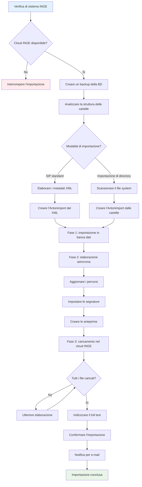

# Importazione SIP in Anton

## Panoramica

L'importazione SIP consente di importare automaticamente in Anton pacchetti archivistici (SIP – Submission Information Packages). Tutti i documenti, i metadati e la struttura delle cartelle vengono ripresi e conservati in modo sicuro nel cloud INGE.

Il processo di importazione si articola in tre fasi principali, corrispondenti alle schede dell'interfaccia di Anton:

1. **Caricamento** – caricare il file SIP
2. **Validazione** – verificare e validare il file  
3. **Ingest** – eseguire l'importazione ed elaborare i documenti

!!! note "Un hub di importazione comune"
    Tutte le vie di importazione (SIP, Excel, directory, agate) sono raccolte sotto `/import` — le schede SIP sono ora integrate nell'hub di importazione come scheda **«SIP»**. I vecchi segnalibri continuano a funzionare (reindirizzamento trasparente).
    Vedi [import.md](import.md).

## Caricamento

- La dimensione massima dei file dipende dalla configurazione di sistema. Si prega di segnalare eventuali problemi all'amministrazione.

## Validazione

### Verifica automatica del file

#### Che cosa verifica il sistema

- La completezza del file ZIP  
- La presenza del metadata.xml secondo lo standard eCH-0160  
- L'integrità di tutti i file di documento (somme di controllo MD5)  
- La correttezza della struttura di cartelle e della gerarchia (in particolare se le unità radice del SIP possano essere agganciate alla struttura archivistica esistente)  
- L'univocità (i SIP già importati vengono riconosciuti)

#### Che cosa si vede

- Un rapporto di validazione dettagliato  
- Segni di spunta verdi per le verifiche riuscite  
- Messaggi di errore rossi con indicazioni concrete  
- Lo stato «validazione superata» oppure «validazione fallita»

#### Possibili problemi

- Non è possibile trovare il livello superiore per le unità radice
- File ZIP danneggiato o incompleto  
- metadata.xml mancante o non valido  
- File di documento difettosi  
- File SIP già importato

## Ingest

### Flusso dell'importazione SIP

!!! Bug "Se l'importazione fallisce" 
    - Aprire la scheda SIP nell'archivio delle accessioni  
    - Ripristinare la banca dati dal backup (i file vengono sincronizzati con Inge/Dimag)  

### Modalità di importazione

#### Importazione SIP standard

L'impostazione `import-dossier-from-directory` deve essere vuota oppure impostata su 0 o false.

#### Funzionamento
- La struttura delle cartelle viene creata dai metadati XML (struttura unità/documenti)
- Ogni unità, ogni sottocartella e ogni documento è definito nel metadata.xml
- La gerarchia si basa sulla struttura XML dell'`<ablieferung>` (relazioni padre-figlio)

#### Vantaggi
- Metadati completi provenienti dal sistema versante
- Ripresa esatta della struttura logica del SIP
- Informazioni su contesto di creazione e provenienza ricavate dal XML

#### Importazione di directory

Nel `metadata.xml` sono presentate due strutture:  

1) La struttura di deposito dei file nel file system (cartelle/file) nella cartella `content` corrisponde all'`<inhaltsverzeichnis>` nel `metadata.xml`  
2) L'elemento `ablieferung` contiene la collocazione nella gerarchia complessiva (elementi `<ordnungssystem>`, `<ordnungssystemposition>`) nonché la struttura logica del contenuto vero e proprio del versamento in unità (`dossier>`) e documenti (`<dokument>`) (i documenti possono contenere un rimando a dei file).

Le due strutture possono corrispondere, ma non necessariamente. Nella pratica esistono unità la cui struttura di deposito si discosta notevolmente da quella logica. Può quindi essere sensato riprendere la struttura di deposito invece della struttura SIP effettivamente prevista.

L'impostazione `import-dossier-from-directory` deve essere impostata su 1 o true.

!!! note "Importante"
    L'importazione di directory funziona solo con un'unità per SIP.

#### Funzionamento

La gerarchia viene creata a partire dal file system del file SIP (cartella `content`, che corrisponde alla struttura cartelle-file nel metadata.xml; la struttura logica di unità e documenti viene ignorata. Nemmeno i metadati possono essere importati.)

- La cartella radice all'interno della cartella content viene equiparata all'unità del SIP.
- I metadati dei file vengono generati dalle proprietà dei file (per quanto possibile).
- I metadati XML vengono utilizzati solo per l'unità radice.

## Durata
Esempio: l'importazione di 100 schede con 100 file dura circa 10 minuti.

Durante la fase 1 la pagina non risponde e il browser non deve essere chiuso. Nell'esempio questa fase dura circa 2 minuti.

La fase 2 si svolge in modo asincrono, ma nel browser non è ancora percepibile (altri 2 minuti).

Successivamente è possibile seguire l'avanzamento della fase 3 da parte del sistema.

*Ultimo aggiornamento: 2025-08-05*
