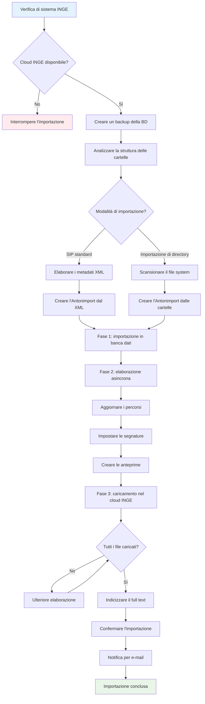

# Importazione SIP in Anton

## Panoramica

L’importazione SIP porta in Anton pacchetti d’archivio secondo eCH-0160 (SIP, Submission Information Packages): documenti, metadati e struttura delle cartelle. Ha quattro schede:

1. **Caricare** – depositare file SIP
2. **Verificare e importare** – verificare o importare ogni SIP caricato, con tutti gli eventi sotto
3. **SIP importati** – i SIP già importati
4. **Documentazione**

!!! note "Un hub di importazione comune"
    Tutti i percorsi di importazione (SIP, Excel, directory, agate) sono riuniti sotto `/import`. Vedi [import.md](import.md).

## Caricamento

- I SIP possono essere caricati come ZIP, TAR o TAR.GZ, anche più alla volta. La dimensione massima dipende dalla configurazione del sistema; si prega di segnalare eventuali problemi all’amministrazione.
- Se esiste già un file con lo stesso nome, o lo stesso contenuto è già presente o già importato, Anton non deposita subito il file ma chiede prima:

| Constatazione | Scelta |
|---|---|
| stesso nome, stesso contenuto («già presente, invariato») | Scartare |
| stesso nome, altro contenuto («sostituisce …») | Sostituire o Scartare |
| stesso contenuto con un altro nome | Depositare comunque o Scartare |
| stesso contenuto già importato (con data e segnatura) | Depositare comunque o Scartare |

I file senza constatazioni vengono depositati subito.

## Verificare e importare

La tabella mostra ogni SIP caricato, il più recente in alto, con dimensione, data e ultimo controllo. Il controllo si riferisce al contenuto del file, non al suo nome: se con lo stesso nome viene caricato un altro SIP, la colonna mostra di nuovo «–».

- **Verificare** mostra tutte le constatazioni senza importare nulla.
- **Importare** avvia l’importazione. L’importazione verifica comunque da sé il SIP; un controllo preliminare non è una condizione.
- Un SIP in fase di verifica o di importazione può essere eliminato solo dopo.

### Il controllo

La pagina del controllo mostra tutti i passi con il loro stato; il passo in corso ha una barra di avanzamento:

1. Decomprimere il SIP
2. Controllare la struttura del SIP (anche: già importato?)
3. Controllare i metadati rispetto allo schema
4. Controllare lo stato di accesso pubblico
5. Controllare file e somme di controllo
6. Controllare i punti di aggancio dei dossier (i dossier radice possono essere agganciati alla struttura esistente?)
7. Controllare la gerarchia
8. Controllare i dati

Un errore nei passi da 1 a 3 termina il controllo; i passi successivi mostrano allora «non raggiunto». Alla fine le constatazioni sono elencate per tipo, con spiegazione e raccomandazione. Se il SIP è valido, può essere importato da lì.

Un controllo che supera il suo limite di tempo è considerato «interrotto» e va riavviato.

### Eventi

Sotto la tabella si trovano tutti gli eventi dei SIP: caricamento (anche sostituito o scartato), controllo, importazione, spostamento dopo l’importazione ed eliminazione – con momento, file, risultato e utente. Un controllo porta alla sua pagina, un’importazione al suo svolgimento.

## SIP importati

Dopo un’importazione riuscita, Anton archivia qui il SIP, con la segnatura dell’importazione davanti al nome del file. Resta scaricabile; solo gli amministratori possono eliminarlo.

## Ingest

### Flusso dell'importazione SIP

```mermaid
flowchart TD
    A[Verifica di sistema INGE] --> B{Cloud INGE disponibile?}
    B -->|No| C[Interrompere l'importazione]
    B -->|Sì| D[Creare un backup della BD]
    
    D --> E[Analizzare la struttura delle cartelle]
    E --> F{Modalità di importazione?}
    
    F -->|SIP standard| G[Elaborare i metadati XML]
    F -->|Importazione di directory| H[Scansionare il file system]
    
    G --> I[Creare l'Antonimport dal XML]
    H --> J[Creare l'Antonimport dalle cartelle]
    
    I --> K[Fase 1: importazione in banca dati]
    J --> K
    
    K --> L[Fase 2: elaborazione asincrona ]
    L --> M[Aggiornare i percorsi]
    M --> N[Impostare le segnature]
    N --> O[Creare le anteprime]
    O --> P[Fase 3: caricamento nel cloud INGE]
    
    P --> Q{Tutti i file caricati?}
    Q -->|No| R[Ulteriore elaborazione]
    Q -->|Sì| S[Indicizzare il full text]
    
    R --> Q
    S --> T[Confermare l'importazione]
    T --> U[Notifica per e-mail]
    U --> V[Importazione conclusa]
    
    style A fill:#e3f2fd
    style V fill:#e8f5e8
    style C fill:#ffebee
```

!!! Bug "Se l'importazione fallisce" 
    - Aprire la scheda SIP nell'archivio delle accessioni  
    - Ripristinare la banca dati dal backup (i file vengono sincronizzati con Inge/Dimag)  

### Modalità di importazione

#### Importazione SIP standard

L'impostazione `import-dossier-from-directory` deve essere vuota oppure impostata su 0 o false.

#### Funzionamento
- La struttura delle cartelle viene creata dai metadati XML (struttura unità/documenti)
- Ogni unità, ogni sottocartella e ogni documento è definito nel metadata.xml
- La gerarchia si basa sulla struttura XML dell'`<ablieferung>` (relazioni padre-figlio)

#### Vantaggi
- Metadati completi provenienti dal sistema versante
- Ripresa esatta della struttura logica del SIP
- Informazioni su contesto di creazione e provenienza ricavate dal XML

#### Importazione di directory

Nel `metadata.xml` sono presentate due strutture:  

1) La struttura di deposito dei file nel file system (cartelle/file) nella cartella `content` corrisponde all'`<inhaltsverzeichnis>` nel `metadata.xml`  
2) L'elemento `ablieferung` contiene la collocazione nella gerarchia complessiva (elementi `<ordnungssystem>`, `<ordnungssystemposition>`) nonché la struttura logica del contenuto vero e proprio del versamento in unità (`dossier>`) e documenti (`<dokument>`) (i documenti possono contenere un rimando a dei file).

Le due strutture possono corrispondere, ma non necessariamente. Nella pratica esistono unità la cui struttura di deposito si discosta notevolmente da quella logica. Può quindi essere sensato riprendere la struttura di deposito invece della struttura SIP effettivamente prevista.

L'impostazione `import-dossier-from-directory` deve essere impostata su 1 o true.

!!! note "Importante"
    L'importazione di directory funziona solo con un'unità per SIP.

#### Funzionamento

La gerarchia viene creata a partire dal file system del file SIP (cartella `content`, che corrisponde alla struttura cartelle-file nel metadata.xml; la struttura logica di unità e documenti viene ignorata. Nemmeno i metadati possono essere importati.)

- La cartella radice all'interno della cartella content viene equiparata all'unità del SIP.
- I metadati dei file vengono generati dalle proprietà dei file (per quanto possibile).
- I metadati XML vengono utilizzati solo per l'unità radice.

## Durata
Esempio: l'importazione di 100 schede con 100 file dura circa 10 minuti.

Durante la fase 1 la pagina non risponde e il browser non deve essere chiuso. Nell'esempio questa fase dura circa 2 minuti.

La fase 2 si svolge in modo asincrono, ma nel browser non è ancora percepibile (altri 2 minuti).

Successivamente è possibile seguire l'avanzamento della fase 3 da parte del sistema.

*Ultimo aggiornamento: 2026-10-01*
