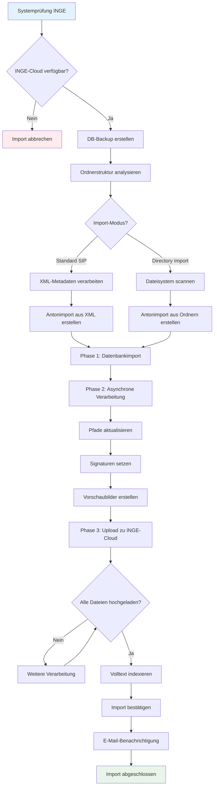

# SIP-Import in Anton

## Übersicht

Der SIP-Import ermöglicht es, Archivpakete (SIPs - Submission Information Packages) automatisch in Anton zu importieren. Dabei werden alle Dokumente, Metadaten und die Ordnerstruktur übernommen und sicher in der INGE-Cloud gespeichert.

Der Import-Prozess ist in drei Hauptphasen unterteilt, die den Tabs in der Anton-Oberfläche entsprechen:

1. **Upload** - SIP-Datei hochladen
2. **Validierung** - Datei prüfen und validieren  
3. **Ingest** - Import durchführen und Dokumente verarbeiten

## Upload

- Die maximale Dateigrösse ist von der Systemkonfiguration abhängig. Probleme bitte dem Administrator melden.

## Validierung

### Automatische Dateiprüfung

#### Was das System prüft

- Vollständigkeit der ZIP-Datei  
- Vorhandensein der metadata.xml nach eCH-0160 Standard  
- Integrität aller Dokumentdateien (MD5-Checksummen)  
- Korrekte Ordnerstruktur und Hierarchie (insbesondere, ob die Root-Dossiers des SIPs in die bestehende Archivstruktur eingehängt werden können)  
- Eindeutigkeit (bereits importierte SIPs werden erkannt)

#### Was Sie sehen

- Detaillierter Validierungsbericht  
- Grüne Häkchen für erfolgreiche Prüfungen  
- Rote Fehlermeldungen mit konkreten Hinweisen  
- Status «Validierung bestanden» oder «Validierung fehlgeschlagen»

#### Mögliche Probleme

- Parent für Root-Dossiers können nicht gefunden werden
- Beschädigte oder unvollständige ZIP-Datei  
- Fehlende oder ungültige metadata.xml  
- Defekte Dokumentdateien  
- Bereits importierte SIP-Datei

## Ingest

### SIP-Import Workflow

!!! Bug "Wenn der Import fehl schlägt" 
    - Im Akzessionsarchiv den SIP Datensatz aufrufen  
    - Datenbank aus Backup wiederherstellen (Dateien werden mit Inge/Dimag synchronisiert)  

### Import-Modi

#### Standard SIP-Import

Die Einstellung `import-dossier-from-directory` muss leer sein oder auf 0 oder false gesetzt werden.

#### Funktionsweise
- Ordnerstruktur wird aus den XML-Metadaten erstellt (Dossier/Dokumentstruktur)
- Jedes Dossier, jede Mappe und jedes Dokument ist in der metadata.xml definiert
- Hierarchie basiert auf der XML-Struktur der `<ablieferung>` (parent-child Beziehungen)

#### Vorteile
- Vollständige Metadaten aus dem Ablieferungssystem
- Exakte Übernahme der logischen Struktur des SIP
- Informationen zu Entstehungskontext und Provenienz aus XML

#### Directory Import

Im `metadata.xml` werden zwei Strukturen präsentiert:  

1) Die Ablagestruktur der Dateien im Dateisystem (Ordner/Dateien) im Ordner `content` entspricht dem `<inhaltsverzeichnis>` im `metadata.xml`  
2) Das Element `ablieferung` enthält die Verortung in der Gesamthierarchie (Elemente `<ordnungssystem>`, `<ordnungssystemposition>`) sowie die logische Struktur des eigentlichen Inhalts der Ablieferung in Dossiers (`dossier>`) und Dokumente (`<dokument>`) (wobei die Dokumente, einen Verweis auf Dateien enthalten können).

Die beiden Strkturen können sich entsprechen, müssen aber nicht. In der Praxis gibt es Dossiers, deren Ablagestruktur erheblich von der logischen Struktur abweicht. Deshalb kann es sinnvoll sein, die Ablagestruktur und nicht die eigentlich vorgesehene SIP Struktur zu übernehmen.

Die Einstellung `import-dossier-from-directory` muss  auf 1 oder true gesetzt werden.

!!! note "Wichtig"
    Der Directory Import funktioniert nur mit einem Dossier pro SIP.

#### Funktionsweise

Die Hierarchie wird aus dem Dateisystem der SIP-Datei erstellt (Ordner: `content`, das entspricht der Ordner-Datei-Struktur im metadata.xml, die logische Struktur der Dossiers und Dokumente wird ignoriert. Auch die Metadaten können nicht importiert werden.)

- Der Root-Ordner im content Ordner wird mit dem Dossier des SIPs gleichgesetzt.
- Datei-Metadaten werden aus den Dateieigenschaften generiert (soweit möglich).
- XML-Metadaten werden nur für das Root-Dossier verwendet.

## Dauer
Beispiel: Der Import von 100 Datensätze mit 100 Dateien dauert ca. 10 Minuten. 

Während Phase 1 reagiert die Seite nicht und der Browser darf nicht geschlossen werden. Diese Phase dauert im Beispiel ca. 2 Minuten.

Phase 2 läuft asynchron, aber im Browser ist immer noch nicht zu erkennen (nochmal 2 Minuten).

Anschliessend lässt sich verfolgen, wie das System Phase 3 abarbeitet. 

*Letzte Aktualisierung: 2025-08-05*
