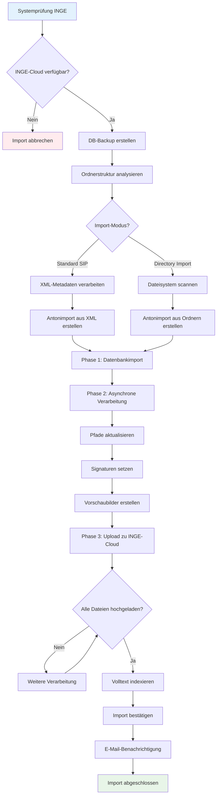

# SIP-Import in Anton

## Übersicht

Der SIP-Import übernimmt Archivpakete nach eCH-0160 (SIPs, Submission Information Packages) in Anton: Dokumente, Metadaten und Ordnerstruktur. Er hat vier Reiter:

1. **Hochladen** – SIP-Dateien ablegen
2. **Prüfen und importieren** – jedes hochgeladene SIP prüfen oder importieren, darunter alle Ereignisse
3. **Importierte SIPs** – die SIPs, die schon importiert sind
4. **Dokumentation**

!!! note "Gemeinsamer Import-Hub"
    Alle Import-Pfade (SIP, Excel, Verzeichnis, agate) sind unter `/import` zusammengefasst. Siehe [import.md](import.md).

## Hochladen

- SIPs können als ZIP, TAR oder TAR.GZ hochgeladen werden, auch mehrere auf einmal. Die maximale Dateigrösse hängt von der Systemkonfiguration ab; Probleme bitte der Administration melden.
- Liegt schon eine Datei mit demselben Namen vor, oder ist derselbe Inhalt schon vorhanden oder bereits importiert, legt Anton die Datei nicht sofort ab, sondern fragt nach:

| Befund | Wahl |
|---|---|
| gleicher Name, gleicher Inhalt («liegt schon unverändert vor») | Verwerfen |
| gleicher Name, anderer Inhalt («ersetzt …») | Ersetzen oder Verwerfen |
| gleicher Inhalt unter anderem Namen | Trotzdem ablegen oder Verwerfen |
| gleicher Inhalt schon importiert (mit Datum und Signatur) | Trotzdem ablegen oder Verwerfen |

Dateien ohne Befund werden sofort abgelegt.

## Prüfen und importieren

Die Tabelle zeigt jedes hochgeladene SIP, das neueste zuoberst, mit Grösse, Datum und der letzten Prüfung. Die Prüfung gehört zum Inhalt der Datei, nicht zu ihrem Namen: Wird unter demselben Namen ein anderes SIP hochgeladen, steht dort wieder «–».

- **Prüfen** zeigt alle Befunde, ohne etwas zu importieren.
- **Importieren** startet den Import. Der Import prüft das SIP ohnehin selbst; eine Prüfung vorher ist keine Bedingung.
- Ein SIP, das gerade geprüft oder importiert wird, lässt sich erst danach löschen.

### Die Prüfung

Die Prüfseite zeigt alle Schritte der Prüfung mit ihrem Zustand; der laufende Schritt hat einen Balken:

1. SIP entpacken
2. Aufbau des SIP prüfen (auch: schon importiert?)
3. Metadaten gegen das Schema prüfen
4. Öffentlichkeitsstatus prüfen
5. Dateien und Prüfsummen prüfen
6. Einhängepunkte der Dossiers prüfen (können die Root-Dossiers in die bestehende Archivstruktur eingehängt werden?)
7. Hierarchie prüfen
8. Angaben prüfen

Ein Fehler in Schritt 1 bis 3 beendet die Prüfung; die folgenden Schritte stehen dann auf «nicht erreicht». Am Ende stehen die Befunde je Art mit Erklärung und Empfehlung. Ist das SIP gültig, lässt es sich von dort aus importieren.

Eine Prüfung, die länger als ihre Zeitgrenze läuft, gilt als «abgebrochen» und muss neu gestartet werden.

### Ereignisse

Unter der Tabelle stehen alle Ereignisse der SIPs: Hochladen (auch ersetzt oder verworfen), Prüfung, Import, Verschieben nach dem Import und Löschen – mit Zeitpunkt, Datei, Ergebnis und Benutzer:in. Eine Prüfung führt zu ihrer Prüfseite, ein Import zu seinem Lauf.

## Importierte SIPs

Nach einem erfolgreichen Import legt Anton das SIP hier ab, mit der Signatur des Imports vor dem Dateinamen. Es lässt sich weiterhin herunterladen; löschen können nur Admins.

## Ingest

### SIP-Import Workflow

```mermaid
flowchart TD
    A[Systemprüfung INGE] --> B{INGE-Cloud verfügbar?}
    B -->|Nein| C[Import abbrechen]
    B -->|Ja| D[DB-Backup erstellen]
    
    D --> E[Ordnerstruktur analysieren]
    E --> F{Import-Modus?}
    
    F -->|Standard SIP| G[XML-Metadaten verarbeiten]
    F -->|Directory Import| H[Dateisystem scannen]
    
    G --> I[Antonimport aus XML erstellen]
    H --> J[Antonimport aus Ordnern erstellen]
    
    I --> K[Phase 1: Datenbankimport]
    J --> K
    
    K --> L[Phase 2: Asynchrone Verarbeitung ]
    L --> M[Pfade aktualisieren]
    M --> N[Signaturen setzen]
    N --> O[Vorschaubilder erstellen]
    O --> P[Phase 3: Upload zu INGE-Cloud]
    
    P --> Q{Alle Dateien hochgeladen?}
    Q -->|Nein| R[Weitere Verarbeitung]
    Q -->|Ja| S[Volltext indexieren]
    
    R --> Q
    S --> T[Import bestätigen]
    T --> U[E-Mail-Benachrichtigung]
    U --> V[Import abgeschlossen]
    
    style A fill:#e3f2fd
    style V fill:#e8f5e8
    style C fill:#ffebee
```

!!! Bug "Wenn der Import fehl schlägt" 
    - Im Akzessionsarchiv den SIP Datensatz aufrufen  
    - Datenbank aus Backup wiederherstellen (Dateien werden mit Inge/Dimag synchronisiert)  

### Import-Modi

#### Standard SIP-Import

Die Einstellung `import-dossier-from-directory` muss leer sein oder auf 0 oder false gesetzt werden.

#### Funktionsweise
- Ordnerstruktur wird aus den XML-Metadaten erstellt (Dossier/Dokumentstruktur)
- Jedes Dossier, jede Mappe und jedes Dokument ist in der metadata.xml definiert
- Hierarchie basiert auf der XML-Struktur der `<ablieferung>` (parent-child Beziehungen)

#### Vorteile
- Vollständige Metadaten aus dem Ablieferungssystem
- Exakte Übernahme der logischen Struktur des SIP
- Informationen zu Entstehungskontext und Provenienz aus XML

#### Directory Import

Im `metadata.xml` werden zwei Strukturen präsentiert:  

1) Die Ablagestruktur der Dateien im Dateisystem (Ordner/Dateien) im Ordner `content` entspricht dem `<inhaltsverzeichnis>` im `metadata.xml`  
2) Das Element `ablieferung` enthält die Verortung in der Gesamthierarchie (Elemente `<ordnungssystem>`, `<ordnungssystemposition>`) sowie die logische Struktur des eigentlichen Inhalts der Ablieferung in Dossiers (`dossier>`) und Dokumente (`<dokument>`) (wobei die Dokumente, einen Verweis auf Dateien enthalten können).

Die beiden Strukturen können sich entsprechen, müssen aber nicht. In der Praxis gibt es Dossiers, deren Ablagestruktur erheblich von der logischen Struktur abweicht. Deshalb kann es sinnvoll sein, die Ablagestruktur und nicht die eigentlich vorgesehene SIP Struktur zu übernehmen.

Die Einstellung `import-dossier-from-directory` muss  auf 1 oder true gesetzt werden.

!!! note "Wichtig"
    Der Directory Import funktioniert nur mit einem Dossier pro SIP.

#### Funktionsweise

Die Hierarchie wird aus dem Dateisystem der SIP-Datei erstellt (Ordner: `content`, das entspricht der Ordner-Datei-Struktur im metadata.xml, die logische Struktur der Dossiers und Dokumente wird ignoriert. Auch die Metadaten können nicht importiert werden.)

- Der Root-Ordner im content Ordner wird mit dem Dossier des SIPs gleichgesetzt.
- Datei-Metadaten werden aus den Dateieigenschaften generiert (soweit möglich).
- XML-Metadaten werden nur für das Root-Dossier verwendet.

## Dauer
Beispiel: Der Import von 100 Datensätze mit 100 Dateien dauert ca. 10 Minuten. 

Während Phase 1 reagiert die Seite nicht und der Browser darf nicht geschlossen werden. Diese Phase dauert im Beispiel ca. 2 Minuten.

Phase 2 läuft asynchron, aber im Browser ist immer noch nicht zu erkennen (nochmal 2 Minuten).

Anschliessend lässt sich verfolgen, wie das System Phase 3 abarbeitet. 

*Letzte Aktualisierung: 2026-10-01*
